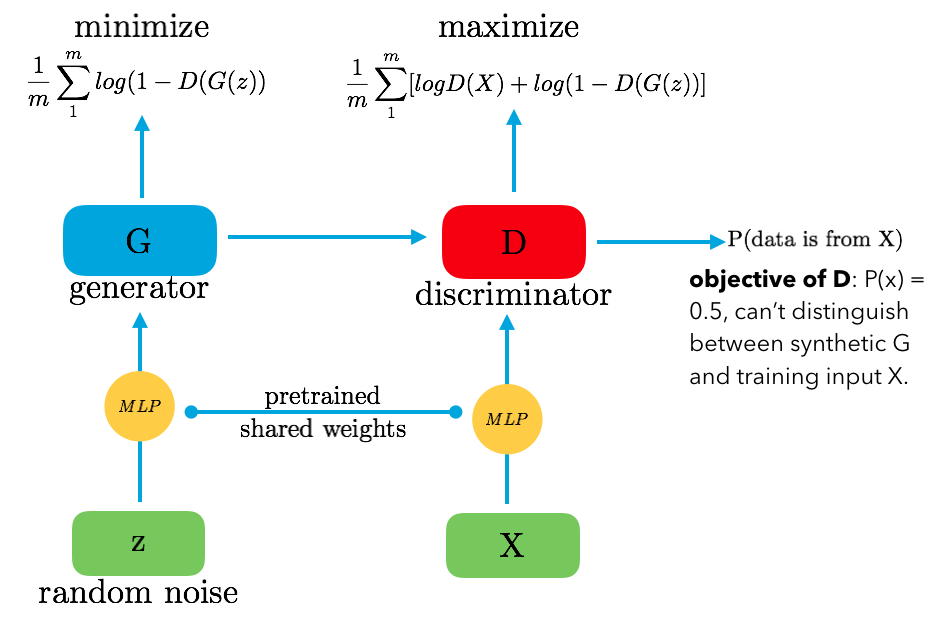
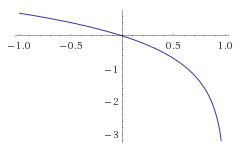
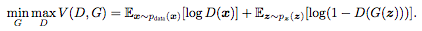
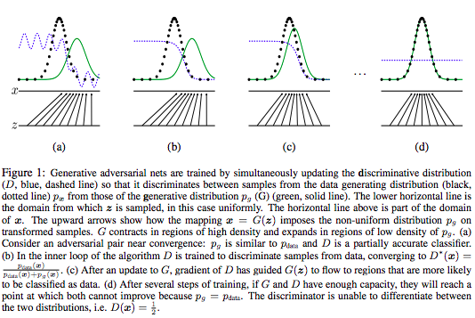
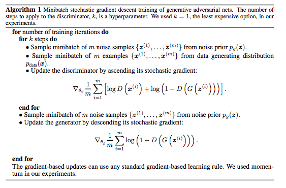

## [Generative Adversarial Networks](https://arxiv.org/abs/1406.2661)

UPDATE: Code for GAN will be here or in the Neural Perspective repo

TLDR; Simultaneously training two models; generative model G that captures the data distribution well and a discriminative model D that tries to predict wether sample came from training data or G. Objective of G is to trick D, therefore making it's goal to learn the training data distribution really well. And objective of D is to get 1/2 score (perfectly predict training data and samples from G). 

### Detailed Notes:
- Both generative model G and discriminative model D are MLPs. D is always the probability that a particular sample is from the training data. 

- The feed into G, is a randomized noise matrix which has the same dimensions as our input data X. We will never input X into G, G can only learn through the gradients from D. D gets half of the samples from G and other half from X. 

- plot of ln(1-x)

- minimax objective:

- We can just optimize to completion because that would cause overfitting. So for every k steps of optimizing D, we do one step of optimizing G. 

- In this algorithm, take a look at the two objective functions. The first one is for D, where we want to maximize log(D) + log(1-D(G(z))), we want to maximize log(1-D(G(z))) because we want D(G(z)) to be low which will give us a high value for log(1-D(G(z))).

- As for the objective function of G, we want to minimize log(1-D(G(z))) because we want D(G(z)) to be high, therefore making log(1-D(G(z))) a low value (high negative number). 

- NOTE: ASCEND (maximize) stochastic gradient for D and DESCEND (minimize) stochastic gradient for G. 

- The optimal value for D is 1/2, which means it can't distinguish between X and G(z).

### Training Points:

- In the beginning, D will easily reject the outputs from G because they will be different from our data since G hasn't learned much yet. So the log(1-D(G(Z))) term will be saturated and close to 0, thus not allowing G to train (derivative at 0 is -1 but the term value itself is ~0, effectively killing the gradient during backprop. So we switch from minimizing (1 - D(G(z))) to maximizing D(G(z)) when training G. 

### Unique Points:

- Advantages include inputs are never copied into G and the learning only occurs through the gradients from D. So we can learn some unbiased distributions (even sharp ones) which is a difficulty with traditional markov chains. 
