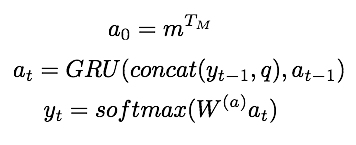

## - [Ask Me Anything: Dynamic Memory Networks for Natural Language Processing] (https://arxiv.org/abs/1506.07285)

TLDR;  The Dynamic Memory Network (DMN) takes in the embedded inputs (truth information) and uses the embedded question to trigger an attentional interface to extract the relevant information from the input. This is then used to generate the right answer to the question.

### Detailed Notes:

#### Input Module
-The input module can range from one to many sentences. If it is just one sentence, the input is represented as the embeddings of all the words fed through an input encoder RNN. But if the input is multiple sentences, first all of the words are embedded. And then an EOS token is inserted after end of each sentence. This is then fed through the same input encoder RNN and the hidden states at each EOS token are extracted and this represents the embedded input. 

-So for one sentence the embedded input is T_c (which has as many elements as the number of words in the sentence). For multiple sentences, the input it T_c (which has as many elements as the number of sentences).

-The input encoder for multiple sentence input is just a GRU, which takes in an input and the previous hidden state to generate the next hidden state.

#### Question module
-For the question, we embed the words in the question using the same embeddings as for the input. 

#### Episodic Memory Module
-This module iterates over our input using the question multiple times to create an episode. During each iteration, an attention mechanism is used over the input using the question and the previous memory (m_{i-1}) to generate the next episode e_i. 

-This episode is then used with the previous memory (m_{i-1}) and fed into an RNN to give us the next memory m_i. The initial state for the memory is just the question representation itself. (m_0 = q). After multiple episodes, we will have many memories m_i. The final memory (m_T) will be fed into the answer module.

#### Why do we need multiple episodes?
-We can think of multiple episodes as necessary for attending to different parts of the sentence after realizing from one pass that something else is important. For example in the image above, we are asking where is the football? In the first pass, it sees that sentence 7 is important because it says football but in the second pass it also picks up on John as relevant information because he was also in the first pass in the same sentence as football. With multiple passes, we can gather more and more relevant information. 

#### Attention Mechanism
-The attention mechanism is a bit different from the usual ones we have seen with NMT. In the attentional interface with NMT, we use the hidden states from the encoder and the previous hidden state from the decoder to feed through tanh and then softmax to get alpha (basically probabilities for each of the hidden states in the encoder). We multiply this alpha by the original encoder hidden states and then sum to get a single context vector c, which acts the weighted concatenation of all the encoder hidden states given the previous decoder state. 

- Here, for each iteration of the input (episode) we will be generating e (which is like our alphas  but is generated using sigmoid so sum of all e's can be > 1). To generate these e's for each pass, we use a gating function (two-layered MLP).

- The output of this gating system is used with a GRU to generate the hidden states e which compose the entire episode.

- The gating system has several advantages but on the main reasons for its use is the opportunity for us to train it. Datasets such as the Facebook babi q/a sets identify which facts in the input are helpful for answering a particular question. The gating mechanism results in e which is the importance for each input in the input, so we can use a cross entropy loss function to train this G. 

- We can know when to stop our iterative passes by setting a maximum amount OR we append an END OF PASSES input representation to our inputs and if the results from an episode have a significant value for this end if passes input representation, we will stop.

#### Answer Module
- After each iteration through the input, we generate a memory (m_i). After the last episode,
we receive the last memory m_T. This memory is passed onto the answer module.

- The predicted answer is trained with the actual answer appended with an EOS token. 

### Training Points:

- performed 18/20 tasks successfully (error < 0.05) compared to the end-end memory network by Weston et. al. 2015 (16/20). 

- Benefits of episodic memory has qualitative results we can see:

### Unique Points:

- I like how the motivation for the episodic memory came from the hippocampus function in our brain. It is able to retrieve temporal states that are triggered by a response (sight, sound, tactile input, etc.)

- When the input is multiple sentences, we only use the hidden states as the EOS tokens as the input. It would be more computation to use the hidden states from every single word but I wonder how this affects performance. Is the EOS token's hidden state enough to capture information for really long inputs (like entire articles)?

