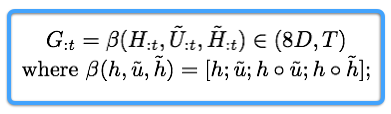

## - [Bidirectional Attention Flow for Machine Comprehension](https://arxiv.org/abs/1611.01603)

TLDR; In order to accurately answer questions based on a document, we need to be able to model complex interactions between the document and query. This paper uses the Bi-Directional Attention Flow (Bi-DAF) network to process an attention context that is query aware, and represents the document at different levels of granularity. It's main advantage is the bidirectional attention flow, which eliminates the early summarization issue we see with normal uni-directional attentional interfaces. Furthermore, the BiDAF does not use just one context vector (summary) but uses vectors from all time steps (so no temporal coupling).  

### Detailed Notes:

- Note: I refer to context from the paper as document because using context and attention context vector c causes confusion.

#### Introduction

- The general BiDAF architecture follows the same pattern as those of competing QA structures (DMN+, DCN, etc.) They all use some form of an attentional interface in order to be able to focus on important parts of the input document with respect to the query. 

- BiDAF uses three different representations of the document at various levels of granularity (character-level, word-level, phrase-level embeddings). Which are then attended to by a bi-directional attentional interface to create a query-aware document representation. 

- Three pitfalls of traditional attentional interfaces:

#### Model

- The model consists of six different layers:

- Now we will dive deeper into each of the six layers. 

- 1.) Character embedding layer: We want to map each word to a higher dimensional vector space. We can achieve this by using character level embeddings for each word using CNNs. The char-level CNN is taken from Yoon's 2015 paper on using CNNs for text classification and was also used in Facebook fully character level NMT model. 

- We will use my notes from the fully char model paper. Instead processing chars in the entire sentence (for NMT), we will process all chars in a particular word. 

- First we will embed each character in our word into vectors which we will input into the CNN as a 1D input. The conv layer gives us an output which we apply max-pooling (using the same width as the word) to get a fixed sized vector for any word.

- The character level embeddings prove to be very useful for OOV tokens and rare words.

- 2.) Word embedding layer: this layer also maps each word to a higher dimensional vector spaces but uses the pre-trained GloVe vectors. We then concat our character and word embeddings and pass onto a two-layer highway network. This network is used for selectively controlling information flow.

 - The output of the highway network are two matrices:
 

 
 - 3.) Phrase embedding layer: we use the results from the highway network to model the temporal interactions between the words. A bi-LSTM is used to receive a higher vector space representations for document vector X and query vector Q. Note that the outputs of the bi-LSTM are vertically stacked and not summed.
 
 - The paper compares these past three layers of processing out document and query a different granularities to the feature computations in a CNN.
 
 - 4.) Attention flow layer: This layer is concerned with joining the information about the document and query. Let's see again how we solve the three pitfalls of traditional attentional interfaces:
 

 
 	1. The layer will not use attention to summarize the entire vector into one context vector c. The layer will, instead, pass the attention vector computed at each time step to the following model layers. The embeddings from the previous layer also pass through in this manner. This really helps out in preventing information loss from early summarization. 
	
	2. The above solution also solves the fact that the attentional interface was temporally dependent, meaning the attention score of a subsequent word is dependent on the current attention. By allowing information to freely flow through to subsequent layers, we resolve this restriction. 
	
	3. The last issues is that attention is usually uni-directional, where the query attends to the each of the document words. This allows us to see the importance for each word in the document, based on the given query. Using a bidirectional attentional interface allows us to see which query words are also most important, given the document. 
	
- The bidirectional attention is determined by using a similarity matrix:

 
 - The first part is the document to query attention: Which means for a given word t in the document, we are trying to determine the attention weights the word causes in each of the J words in the query. The attention weight are called a_t which have dimension J, Which means for any t, the sum of the attention weights a_{tj} = 1. We will use these attention weights to determine the new matrix that has the attended query vectors for each document word. 
 
 - The second part involves the query to document attention. Which means for a given word j in the query, what the attention weights we will see for each word t in the document. So now the attention weights are b which have dimension T, but this time we achieved this by taking the column-wise softmax on S. This gives us the attended vector h which has dimension 2D which we will tiles T times (column-wise) to get (2D, T). 
 

 
 - Finally, we will combine these attention vectors and the phrase-level embeddings:
 
 
 
 - Note that beta could be any MLP but a simple concatenation yields similar results with fewer weights.. 
 
 - 5.) Modeling layer involves encoding G (the query-aware representation of each document word). G is passed into a 2-layer bi-directional LSTM. The output is as follows where each column of M (vector for each word in document) represents the "contextual information about the word with respect to the entire [document] paragraph and query."
 
 
 
- 6.) Output layer: This layer processes M to gives us the answer. This layer can be different depending on the task/dataset. For the Close dataset, we can use softmax on the different classes of possibilities to pick an answer. However, for datasets like SQuAD, we need to determine the start and end locations of the answer in the document. We can do this by using an output layer such as the following:
 
 
 
### Training Points:

- Specific training details in section 4 and ablation results in section 5.

- We can see which context words are attended to for each of the query words. See how words like 'where' and 'many' correspond to the logical linguistic mappings. This shows the saliency of our higher order vector representations. 

### Unique Points:

- An action packed reading; felt like I was in an action movie. 

- The ablation section was truly amazing for interpretability of the model's components. All papers should offer this high level of transparency. Goes to show you don't have to release code to convince performance of a robust model.

