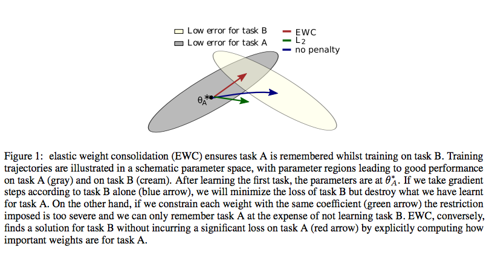
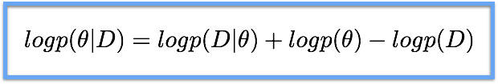
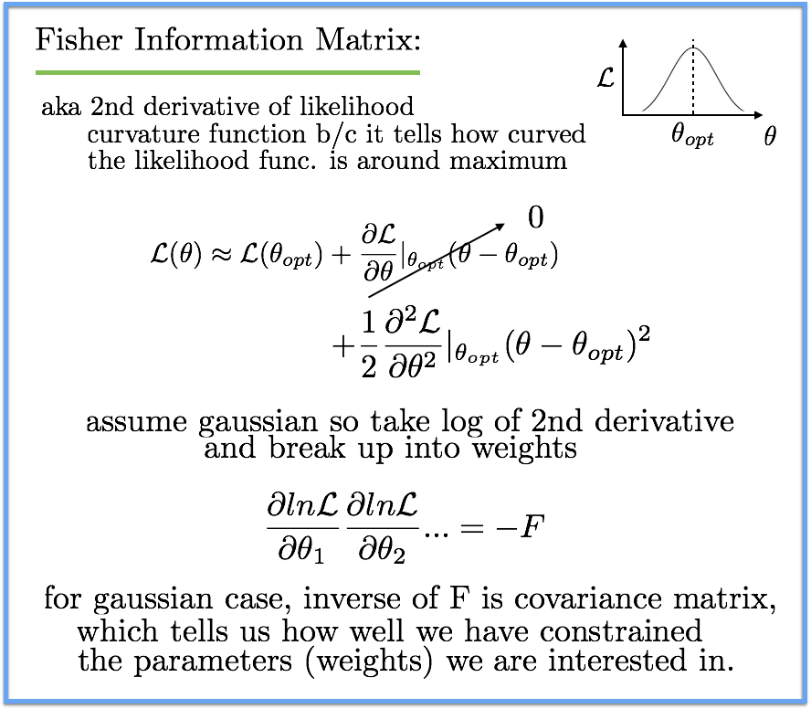

## - [Overcoming Catastrophic Forgetting in Neural Networks](https://arxiv.org/abs/1612.00796)

```bash
Overcoming Catastrophic Forgetting in Neural Networks
James Kirkpatrick, Raia Hadsell, et al.
https://arxiv.org/abs/1612.00796
```

TLDR; Catastrophic forgetting is forgetting key information needed to solve a previous task when training on a new task. However, there are several approaches to combat this issue and allow for continual learning. In this post we will look at DeepMind's elastic weight consolidation (EWC) technique but also talk about previous approaches with a probabilistic perspective. 

Note: I will cover earlier approaches to combat catastrophic forgetting first and then focus on EWC and a few other recent techniques.

### Previous/Alternative Approaches to Combat Catastrophic Forgetting

- We want to have multimodal models that can solve many different tasks well. This single model will provide benefits for all of the involved tasks by allowing for shared representations, etc. However, a common obstacle is catastrophic forgetting, which is forgetting key information needed to solve a previous task when training on a new task. 

- There have been a surge of techniques to combat catastrophic forgetting and to allow for continual learning. One of which is as as simple as an ensemble of DNNs (1). For every new task, a new network is used with a shared representation from the previous task. This approach actually works quite well for all of the tasks but we can never expect this to scale for a large set of different tasks (for training and especially inference). 

- A few of the recent approaches include PathNet (2) which uses an evolutionary approach to deal with the forgetting. In the PathNet, each DNN can have ~20 modules for a given layer and a particular task may choose ~4 modules in each layer. This is sort of like an extension to the ensemble idea but it solves the increasing complexity issue as the number of tasks increase. 

- There have also been some recent approaches that involve using aspects of regularization. The [Joint-Many-Task (JMT) model](https://theneuralperspective.com/2017/03/08/a-joint-many-task-model-growing-a-neural-network-for-multiple-nlp-tasks/) uses successive regularization terms for each tasks's loss in order to combat the forgetting. The successive regularization uses the embedding parameters of the previous task at the current epoch and the previous epoch. This addition prevents the model from forgetting information learned for the previous task(s) when training on the current task. 

- Compared to the approaches above, a more probabilistic approach is elastic weight consolidation (EWC) which will be the main focus of this post. EWC preserved the key information needed to solve previous tasks when training new tasks. This allows for good performance on all tasks and makes way for continual learning. 

### Elastic Weight Consolidation (EWC) 

- The intuition behind EWC comes from task-specific synaptic consolidation in our neocortical circuits. The key to do a particular task is embedded in less pliable synapses, which allows us to remember how to solve previously learned tasks. When we learn a new task, the key synapses from previous tasks still change but are less prone to change because the role they previously played. In terms of DNNs, we just slow down the learning for the weights that were important to previous task(s).

- Let's say we have two tasks: A and B. How do we determine which weights are most important to task A? And by how much do we slow down the learning for the weights? To answer these questions, we need to think about the learning process. Learning involves find parameters (\theta) that allow us to optimize on some objective. One key fact we need to consider is that there exists many combinations of \theta that give us the same optimal performance. This is good news because now we can find some configuration that gives us the best performance for both task A and B. 

- We now have to find a configuration that offers optimal performance for both task A and B. This means that when we train task B, we will need to constrain the parameters such that they still produce a small error for task A. EWC employs a quadratic error as the constraint, as we will see the in the overall loss expression. But before determining the loss, we need to figure out how we are going to weigh the parameters such that the weights that are important to task A are less prone to change. But if task B does involves changing these key weights, then there will be a penalty. We can solve this by thinking in a probabilities perspective.



What we want to do is find the optimal weights (\theta) given some input data D (includes task A and task B data). We can use Bayes rule to expand this expression into the following:



We can go ahead and rewrite the expression above into the following if we assume log p(D|\theta) to be the negative of the loss for the current task (B).


From the expression above, we can see that the only component that accounts for task A is the posterior distribution p(\theta|D_A). We can go ahead and approximate this distribution as a Gaussian dictated by \theta_A and the Fisher matrix. The Fisher matrix is key to figuring out how and which weights influence task A the most. Understanding the basics of the Fisher matrix will make our posterior distribution approximation a bit clearer.



So now our total loss looks like the following expression. The Fisher matrix allows us to account for the parameters that were most important to task A. And the quadratic term allows us to penalize if we decide to shift the weights that were key performers for task A. This loss allows us to find that balanced configuration that offers great performance for both task A and B. 


### Thoughts:

- EWC is just one of the recent successful techniques in combatting catastrophic forgetting. As we saw with some of the other papers, notably [JMT](https://theneuralperspective.com/2017/03/08/a-joint-many-task-model-growing-a-neural-network-for-multiple-nlp-tasks/) with their successive regularization technique, there are many ways to tackle this issue. There has been quite  a bit of investment in using a probabilistic approach (generally assume that the posterior distribution of DNN weights can be approximate with a Gaussian), so that?s why I focused particularly on the EWC on this post.

- But, with the rise of multimodal models and the clear benefits they provide for all the tasks involved, catastrophic forgetting is certainly an issue worth solving. I think it will be another ~year before standards on set in terms of dealing with the issue but even then we may have different options depending on the nature of the dataset (difference in involves tasks, etc) and the important we give to shared representations, etc.

### References:

1. Rusu, Andrei A, Rabinowitz, Neil C, Desjardins, Guillaume, Soyer, Hubert, Kirkpatrick, James, Kavukcuoglu, Koray, Pascanu, Razvan, and Hadsell, Raia. Progressive neural networks. arXiv preprint arXiv:1606.04671, 2016.

2. Fernando, Chrisantha, Banarse, Dylan, Blundell, Charles, Zwols, Yori, Ha, David, Rusu, Andrei A, Pritzel, Alexander, and Wierstra, Daan. Pathnet: Evolution channels gradient descent in super neural networks. arXiv preprint arXiv:1701.08734, 2017.