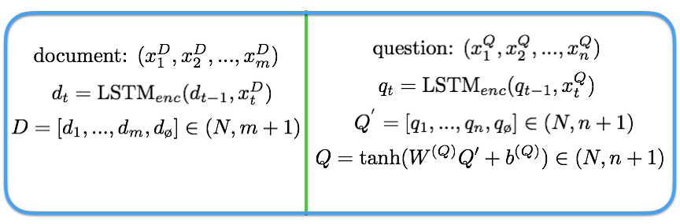

## - [Dynamic Coattention Networks For Question Answering](https://arxiv.org/abs/1611.01604)

TLDR; Using the Dynamic Coattention Network (DCN) which allows for co-dependent representations of the question and documents in order to focus on relevant parts of the document to answer the question.

### Detailed Notes:
- The DCN is an end-to-end architecture that has a coattentive encoder, that processes the question and document, and a dynamic pointing decoder, that determines the start and end of the answer span in the document. 

#### Document and Question Encoder
- We will first process each of the words in the question (n words) and document (m words). A sentinel is also added to each vector representation in order to tell the model to NOT attend to certain words. An LSTM is used to process one word  at a time with a hidden state (d or q) and we use the outputs as the question or document representation.

- To have some variation in the document and question representation, an additional nonlinear layer is applied to the question representation.

#### Coattention Encoder
- The coattention mechanism attends to the question and document representations simultaneously and then we fuse both of the final attention contexts.

- The C^D above is the co-dependent representation of the question and documents, as the coattention context. 

- The last stage of the coattention encoder is to combine the temporal information with the coattention context we just made. We will use this to select the answer span.

#### Dynamic Pointing Decoder

- We will be determining the answer using a start and end location (answer span). This entails that our answer must come from the document it self. 

- In order to avoid local maxima in our answer spans, we do several iterations using our dynamic pointing decoder. Each update will give us a more accurate start and end position estimate.

The start and end positions are determined by argmax of the start and end highway maxout networks (HMN) respectively. Maxout networks and highway networks have shown strong empirical performance with deep architectures. The start and end HMN are different networks that have the same architecture but different weights. Here is a bit of review on maxout and highway networks.

- You can think of the maxout network as a robust nonlinearity but we pay the penalty of having twice the number of weights as we would have with a ReLU. And with the highway connection, we are able to selectively control the information flow and we are able to establish connections from the output of the first maxout layer to the last maxout layer. This gives us great flexibility on the information flow. 

### Training Points:

- The loss is the cumulative cross entropy of the start and end locations across ALL iterations. You can choose to stop iterating once the start and end locations stop changing or set a max amount (4 in this paper). 

- Section 4.1: Preprocessed corpus using tokenizer from Stanford CoreNLP. Used GloVe word embeddings (trained on 840B Common Crawl corpus). Out of vocabulary word embeddings were set to zero. Word embeddings were FIXED as further training resulted in overfitting.

- Max sequence (document) length was 600 (words) with a hidden state size of 200 for all recurrent, maxout and linear layers. 

- Max number of iterations for dynamic decoder is 4 and maxout pool size of 16. Dropout was used in network during training and ADAM optimizer was used.

### Unique Points:

- Currently number 3 (was number 1) on the Stanford Question Answering dataset ([SQuAD](https://rajpurkar.github.io/SQuAD-explorer/)). 

- Some of the more complex questions required all 4 iterative dynamic pointing decoder passes in order to come up with the correct answer span.

- Salesforce has been using Chainer in this paper and in the recent papers (QuaiRNN, etc.). They must have been using it for a while (for GPU related advantages which Tensorflow didn't have until very recently). Luckily Chainer code is very easy to understand if you know Tensorflow.

