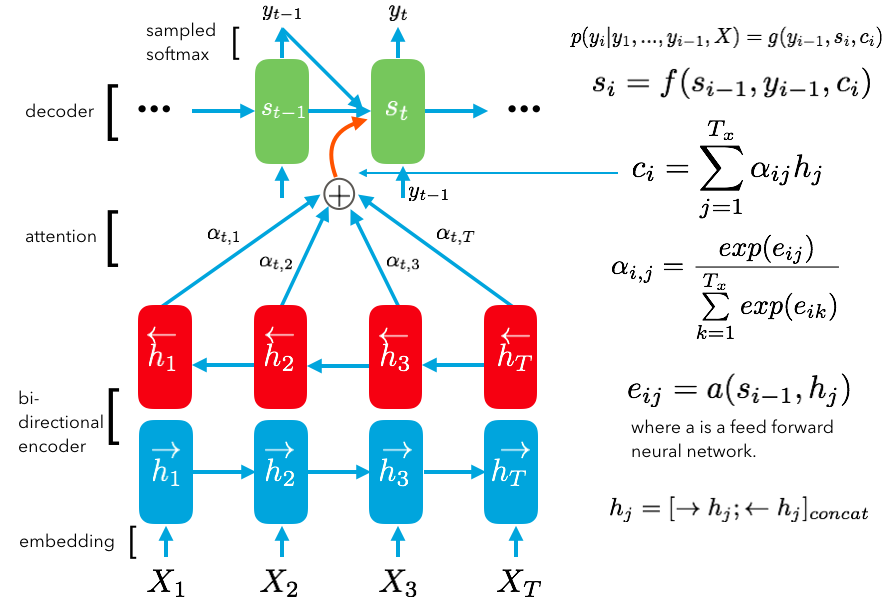

## [Context-Dependent Word Representation for Neural Machine Translation](https://arxiv.org/abs/1607.00578)

TLDR; Word embeddings store a lot of information about each word. When trying to predict the next word in a sequence with machine translation, it is important that we understand each word in the source and target languages with respect to context. To accurately do this, we can use context-aware word embeddings to feed into the encoder to process input source words and into the decoder when creating output target words.

### Detailed Notes:
- Background on machine translation with attention. Note that using context aware word embeddings can be used with any rnn architecture with attention but this paper specifically uses it and sees the performance with machine translation.

- We need context aware embeddings because a certain word can have many different meanings. This is especially important with machine translation because the same word may not share the same multiple meanings as the source language. For example:

- The above was generation by taking a word's embeddings and finding the nearest neighbors. Then we apply PCA to find the 2d euclidean space representation. On one axis, we see all the neighbors of one meaning and on the other axis, we see all the words of another meaning for the same word. This shows us that a our traditional word embeddings represent multiple dimensions of similarity. 

- contextualizing the word embeddings essentially masks these extra dimensions that do not represent the meaning of the word in a particular context. 

- Contextualizing the original word embeddings involves the following:
	1. context: average of the nonlinearly transformed source word embeddings.
	2. We take this context and use it to the mask the embedded inputs we put into the encoder and decoder. Note: for the decoder, the word embeddings coming into play when we are feeding in the previously predicted word into the decoder as the input. This goes through an embedding layer similar to the encoding layer. 
	
- The masking involves using an element wise sigmoid operation that produces a float between [0,1] which we multiply by the original embeddings. 

### Training Points:

- Same RNN with attention structure as Bahdanau's 2015 (bidirectional RNN, soft attention, etc.) except this paper used LSTMs instead of GRUs and used the Adam optimizer with gradient clipping instead of adadelta. 

- Beam search was used when evaluating. More details on models and preprocessing (quite a few limitations in terms of what data they processed) in the paper. Overall, contextualizing and symbolization both improve the BLEU score for machine translation from en to fr and de. 

### Unique Points:

- The paper also addresses the loss of information from using <UNK> tokens. They suggest using an alignment technique for proper nouns, rare words and numbers. Essentially replacing the <UNK> tokens with more specific token types but keeping track of which token maps to which between source and target and then using a look up dictionary to produce the actual word. This technique improved the BLEU scores by 1-2 points. 

