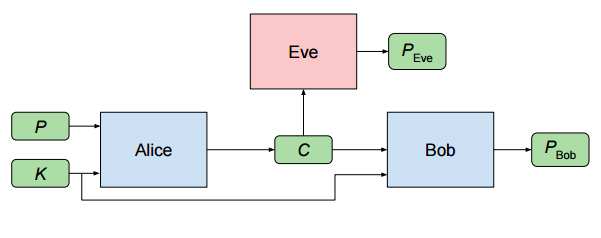
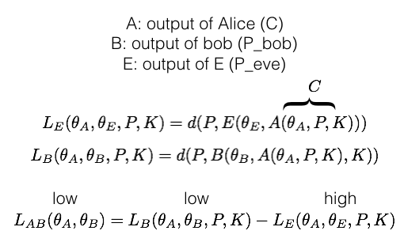
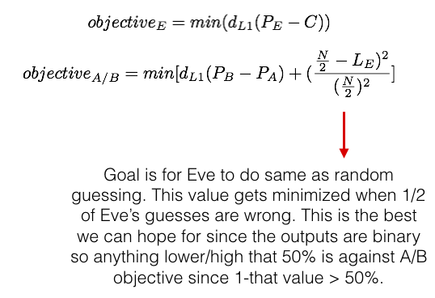
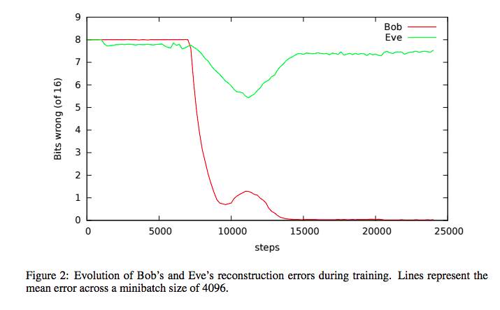

## [Learning to Protect Communications with Adversarial Neural Cryptography](https://arxiv.org/abs/1610.06918)

TLDR; Using adversarial networks to decide how and what to encrypt. You have two nets communicating securely to each other (Alice and Bob) and the third net (Eve) wants to decipher that secure communication.

### Detailed Notes:

- Objective is to maintain secrecy between Alice and Bob. Eve is "passive" in that she can only interject the communication but not actually do anything to change it or insert her own inputs.

- We input a message P ("plaintext") into Alice made of 0/1 (binary) which she translate to C ("ciphertext"). Bob and Eve both receive C and use their net to translate to their own P which they wish to match with the input P. Bob has the advantage of the secret key K which Alice also uses to create C from P. Bob will use the same K with C to create P_bob. 

- P and K can be 0/1 (binary) but obviously, C, P-eve, P-bob can all have floats. In this paper, these floats are restricted to range (-1, 1). Think of P as 0/1, P_eve and P_bob as floats that convert to either 0/1.

## Objective:

- Eve wants to reduce error between P and P_eve. Alice and Bob want to reduce error between P and P_bob and keep their communication a secret (creating a C that maximizes Eve's error).

- Note: d = L1 distance

- CAUTION: When training Alice and Bob, we do not want to maximize's Eve reconstruction error. If we do this, all Eve has to do it reverse the output bits of P_eve and she will be correct.

- What we do want to do is minimize the mutual information between P_eve and P. Basically, we want to make Eve's guess indistinguishable from a random guess. The paper compares this to feature matching (from improved techniques for training GANs), which is basing the loss functions on the activation outputs from the intermediate layers. So if we do that with Eve's net and Alice's net and try to maximize the difference of these values, we will have better chance of making Eve produce random outputs as her P_eve.

### Training Points:

- The nets for A, B and E were all FC layers followed by Conv layers (reverse of image CNNs). This is because we want spatial locality to be a learned feature. The conv layers are arranged so that the final layer gives an output with dimensions of ciphertext (A) or plaintext (for B, E).

- inputs for A/B are size 2N (P + K or C+K). So the FC layers are 2NX2N. Inputs for E are size N (bc just C) so the FC layers are NX2N. A/B train for 1 minibatch whereas E trains for 2 minibatches. The reason in discrepancy is to give E a slight advantage so that A/B can really develop a very robust solution.

- Sigmoid activation units except last layer since we want outputs in range (-1, 1) so use tanh there.

- P and K are randomly selected from uniform distribution and in this paper they were 16, 32, 64 numbers (0/1). 

- Results: Each sample is fed one by one. The results below show the number of bits incorrect (y-axis) for B and E.

### Unique Points:

- The paper notes that minibatch size had a big effect is wether training was successful or not (successful means objectives for A/B, E had to reach some measured performance threshold). This leads me to think that the frequency of updates during training for A/B and then independently for E also has a major impact.

- Training was about 50 percent successful so there's plenty of room for future work but there is additional section on learning WHAT to protect which is very interesting. "Protecting information selectively while maximizing utility" is quite the goal.

