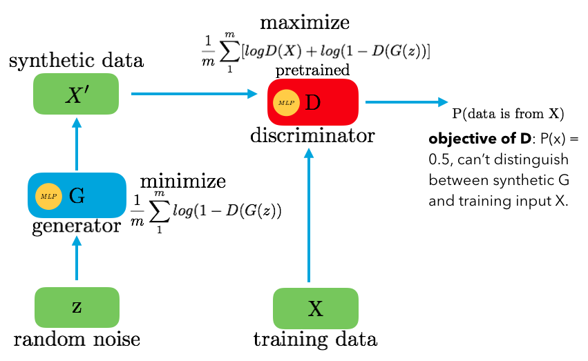
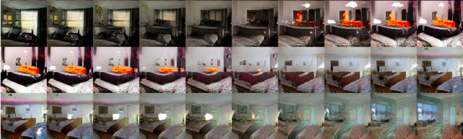
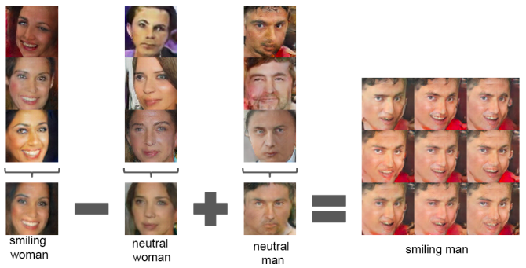
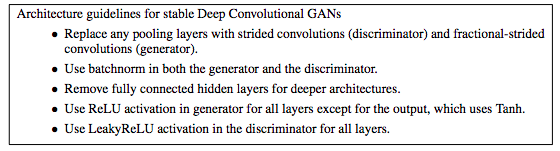
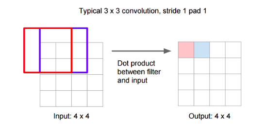
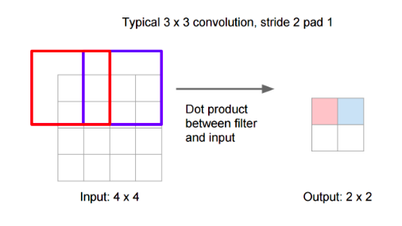
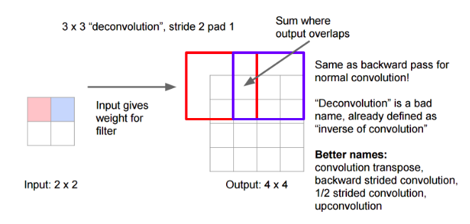

## [Unsupervised Representation Learning with Deep Convolutional Generative Adversarial Networks](http://arxiv.org/abs/1511.06434v2)

TLDR; Using GANs with CNN for unsupervised learning. 

Traditional GAN:

### Detailed Notes:

- Very similar to a traditional GAN but instead we have deconv in the generator. The objective of D is to predict wether the input into D was from the training set or generated. This is not a classification task of any kind. 

- The generator is fed z (a 100 dimensional uniform vector) and goes through upsamling to eventually generate an image which will then be fed into the discriminator. More details on upsampling implementation below Training Points section.

![upsample] (images/dcgam/upsample.png)

- What is being learned here are the filters in the upsampling process which are used to process the low dimensional z into the higher dimensional image. 

- the conv layers of the discriminator were max-pooled and flattened and used as a feature extractor. An L2-SVM was placed on top and trained in order to do image classification. The performance was decent but not as good as deep CNNs. 

- When looking at the latent space, we can see how the model has learned interesting representations. In each row below, for each image you see was generated by a random noise z. But the z's are all similar to each other (you have first z, then second z has +delta, then third z has +2*delta, etc.) And when you run the z through the generator, you can produce the images and you can see the nice transitions. 

- Guided backpropagation allows us to see what the filters of the discriminator pick up on. The DCGAN discriminator filters are very successful in picking up different but key structures in the bedroom (bed, ceiling, lamp, etc.). 

- We can also do some interesting vector work like below. We start with 3 z vectors that end up producing a smiling woman. We average these 3 for stability and then repeat for neutral woman and neutral man. We can now subtract neutral woman from smiling woman and add neutral man to get smiling man! On the right side, you have 9 images. Only the center one if the result but we generate the other 8 by introducing a random noise to the output used for generating the center image. 

### Training Points:

- A common approach now is an all convolutional network (no max pooling), which allows the CNN to learn it's own downsampling. In this paper, the generator uses this principle to learn it's own spatial upsampling, and it also used in the discriminator. 

- no more full connected layers after the CNN. A random noise z is fed into G (which is basically an FC network) and the output is reshaped in the 4D tensor and fed into the discriminator. In the discriminator, the last conv layer is flatted and fed in to a sigmoid unit for prediction. 

![upsample] (images/dcgam/upsample.png)

- Batch norm used to improve poor weights initialization and gradient flow (recall that batch norm gives zero mean and unit variance to all the inputs of a layer). In order to prevent model instabilty which arises if we aply batch norm to all the layers, batch norm was only used at the output layer of the generator and the input layer of the discriminator. 

- Leaky ReLU used in G except for the output layer, which has tanh. The bounded tanh function allows for quick saturation, which actually allows the model to learn quickly in this case. 

- Hyperparameter specifications detailed in the paper.

### Notes on fractionally-strided convolution ("deconv", upsampling, etc.)

- First let's start with regular convolution; imagine an 4X4 input image with padding =1. Running a 3X3 filter on it with stride =1 will give us another 4X4 and will look like this:

 - With stride 2 and pad 1, the convolution will look like this:
 
 
 
 - Now upsampling will look something like this:
 
 
 
- deconv involves using our low resolution output and using the filters to go backwards and create that high resolution input. The weights of the filters will be trained with the object of increasing D(G(z))

image source: CS231n 

