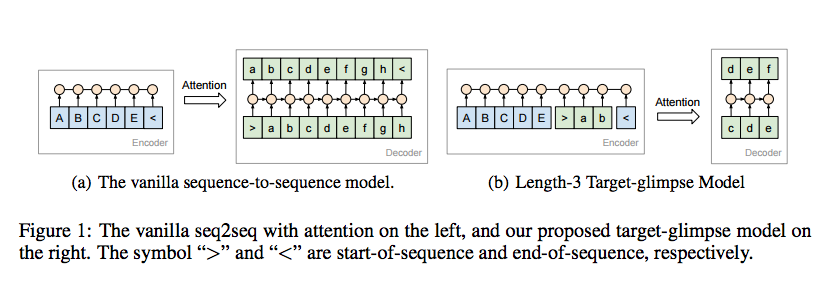

## - [Generating Long and Diverse Responses with Neural Conversation Models](https://openreview.net/pdf?id=HJDdiT9gl)

TLDR; Introduces the glimpse model with a stochastic beam-search algorithm to generate long, coherent responses for conversations. 

Note: Not a math heavy paper but requires a refresher on seq-to-seq models for NMT and basics of attentional interfaces and beam-search. 

### Detailed Notes:
- The main issue with current conversational models based on sequence-to-sequence architectures is that they produce short, generic responses. This paper explores two modifications. The first is the glimpse model which trains on fixed-sized segments from the target. The second is a segment oriented stochastic decoder which results in diverse responses from the get-go in the decoding stage. 

- Traditional seq-to-seq architecture

- The sequence-to-sequence approach for conversations needs to be different from translation because the task at hand is fundamentally different. With translation, the source provides us all the semantic information we need to decode the target sequence. But with conversation, the target response can be very different from the semantic information stored in the source. The example the paper provided was a asking a short, simple question that may solicit a long, detailed response (Ex. What did you do today?).

#### Target Glimpse Model

- The image illustrates an example of the glimpse model with fixed target size of 3. 

- Therefore, using the same seq2seq architecture for conversation as translation leads to a few issues. The first is failing to generate long responses and even if we explicitly call for longer responses (such as length-normalization), the results are incoherent. This is largely due to the decoder having to store all of it's previous outputs as one hidden state vector. The paper proposes target-side attention into the decoder which allows for consideration of the target sequence thus far. They further extend this idea into their "glimpse model", which trains the decoder on fixed-length segments from the target. This allows us to apply the target side attention for really long responses.

- Overall steps for the target-glimpse operations.

- We want to use this target side attention to generate long and coherent responses. All of the current methods to provide coherent responses such as length-normalization coupled with reranking the N-best maximum a posteriori (MAP) responses using some diversity inclines features fail when applied to long sequence generations. This paper explores breaking up the reranking over short segments and to continuously rerank segment by segment. This allows us to create diverse responses earlier in the decoder processing. 

#### Stochastic Decoding with Segment-by-Segment Reranking

- Just a quick review on beam search (nice, short [tutorial](https://www.youtube.com/watch?v=UXW6Cs82UKo)): We keep a set of B highest scoring sequences at each decoder step. At each step, we will account for all possible single tokens we can append to our predicted target sequence so far and store the top B (highest product of normalized log probabilities). Since we want to increase the diversity, the paper employs a stochastic sampling operation as opposed to the traditional deterministic top B selection method. 

- Overall steps for the stochastic decoding. The set \Phi is a set of the Q randomly sampled source sequences. This is basically a Monte-Carlo approximation where the set is unbiased from P(X). 

### Unique Points:

- Model details are elaborated in the paper but a few set values for the parameters mentioned above are Q=15, H=10, B=2, D=10, K=10. 

- Quite a few large experiments done with this new architecture. Information on the evaluation criteria and performance can be found in section 5.1 and 5.2, respectively. However, I do want to highlight the datasets used/created, which the authors aim as a new standard for testing conversational models, as previous datasets were limited in scope and size.

	1. [Reddit] (https://redd.it/3bxlg7) data (1.7 billion messages, 221 million conversations).
	2. 2009 Open Subtitles data (0.5 million conversations).
	3. The Stack Exchange data (0.8 million conversations).
	4. 17 million conversation from the web.

#### Takeaway

- The results were quite nice, compared to the previous SOTA quality. However, there is still quite a bit of work as we still see some redundancy/incoherence in some long responses. However, the paper proves how these two architectural changes can have a drastic impact on the conversation quality. Additionally, these large datasets from the paper give us a chance to train on different data scopes for future models. 

- This is a big step towards improving conversations in terms of diversity and long. coherent responses. I will be implementing this model using the new datasets and perform some ablation studies with the goal of improving on the architecture. 
