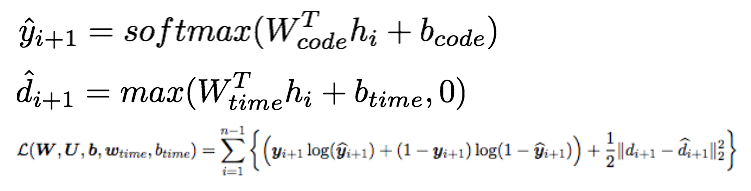

## [Doctor AI: Predicting Clinical Events via Recurrent Neural Networks](http://arxiv.org/abs/1511.05942)

TLDR; Using patient EHR records, we will predict the diagnosis and medical code that will be issued in the next visit using RNNs to capture the longitudinal EHR patterns. We will also try to predict the time until the next visit. 

### Detailed Notes:
- The main goal was to use RNN, where input is embedded patient EHR data and output is diagnosis and medical codes for next visit, as well as, time until next visit. 

- The initialization of the RNN involved using skip-gram embeddings. 

- INPUT are a patient's ICD-9 diagnosis, medication and procedure codes which are time stamped with the patient's previous visit (since the code was what was to be predicted last visit). 

- General architecture:

- By feeding in x_i, we want to receive y_{i+1} and d_{i+1} as the outputs from the RNN, where y_{i+1} are diagnosis and medication classes for the next visit and d_{i+1} is the time until the next visit: d_{i+1} = t_{i+1} - t_i

- Input are the medical and diagnosis multi-hot input vector which then goes through embedding to become a lower dimensional vector. The second input is d_i which is the duration since the last visit. We feed this into our network to predict the multi-hot vector for medical and diagnosis class for the next visit using a softmax classifier and we predict duration until next visit using ReLU. 

- For embedding the medical and diagnosis codes, we have several options. Option (1) is to train the embeddings with the RNN end-to-end. The second option (2) is to pre-train the medical and diagnosis codes with a skip-gram method and use these embeddings as the initialization into the embedding weights into the RNN. Then we commence training end-to-end like option (1). Option 2 consistently out performed option 1 . 

- Training with skip-gram will be something like this. Skip-gram in word2vec meant using each word and predicting the context words (before and after). Here we will use a particular disease or medical code and predict the previous and future medical/diagnosis codes to pre-train and learn embeddings. 

### Training Points:

- GRU is used because it offers similar performance as LSTM but much less complex. 

- Pre-training our medical diagnosis embedding weights with skip-gram architecture consistently out performs random embedding initialization. 

### Unique Points:

- There are over 11,000 unique ICD-9 codes but many are subcategories of each other (ex. 011.01, 011.03, etc.). So we just group them into one (ex. 011 which represents pulmonary tuberculosis) is enough information for the doctor. This greatly reduced the number of codes while still retaining the pertinent information. 

