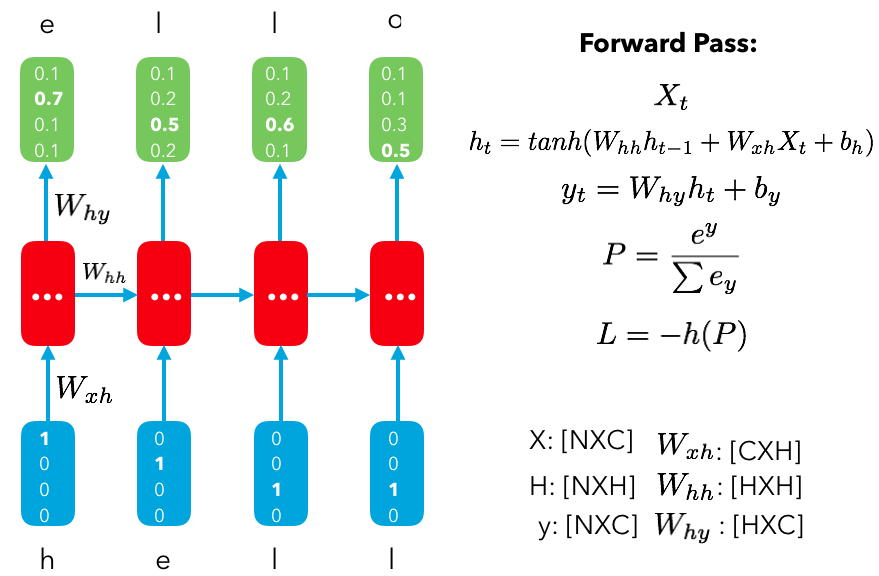
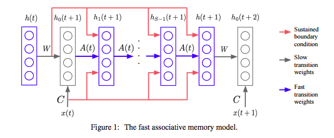
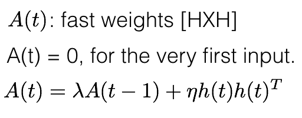
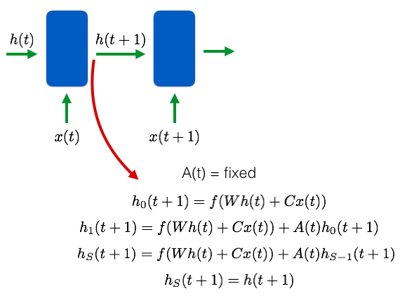

## - [Using Fast Weights to Attend to the Recent Past] (https://arxiv.org/abs/1610.06258)

TLDR; Our RNN hidden states hold memory of the previous states and we have our input and hidden weights to shape the input and next hidden state. However, we have to wait until a batch ends in order to update our input and hidden weights. We can use fast weights (which update after each input in a sequence) in order to update the subsequent hidden state. This is analogous to a working memory in our brains which we can use for associative memory. We can quickly learn how to capture meaningful features in the data without saving to wait for the slow weights to update. 

### Detailed Notes:

- RNNs have two types of memory. You have the hidden states which has the memory from all the previous states. This is like our short term memory and it is updated at every time step. The second type of memory is long term memory which is our weights. They tell us how to update our hidden states, and change our inputs to get our outputs. These are updated less frequently (end of sequences) with the BPTT.

- A third memory could prove useful. The synapses in our brain fire at different time scales so it doesn't make sense to restrict our selves to just these two types of memory (short by rapid updates and long but delayed updates). We can make this third type of memory, which will have higher storage capacity than the hidden state memory but will update faster than our weights. 

## Fast associative memory:
- Essentially, this is a local set of weights that update after each input and shape the composite hidden state and input of each state. We don't have to wait for the slow weights (hidden and input weights) to update after each batch in order to process our inputs. 

- Fast weights allow us to use the previous hidden states in order to process the current input with different set of weights. Our slow weights still produce the outcome as usual to create the next hidden state, but now our fast weights have some weight on that subsequent hidden state.

## Architecture and operations:

- Above is the traditional RNN. W_hh and W_xh are the slow weights that are static until the update at the end of the sequence. When going from one h(t) to h(t+1), we will take the h(t) and convert to h_s (t+1) using fast weights A(t).

"Assuming that the fast weights decay exponentially, we now show that the effect of the fast weights on the hidden vector during an iterative settling phase is to provide an additional input that is proportional to the sum over all recent hidden activity vectors of the scalar product of that recent hidden vector with the current hidden activity vector, with each term in this sum being weighted by the decay rate raised to the power of how long ago that hidden vector occurred."

- Yes, that is one sentence from the paper. I think my brain needs some extra fast weights to absorb all of that in one attempt. So let's break down the procedure and take a closer look at how we compute this new hidden state and how the fast weights are calculated/updated.

- For the very first input, A(t) = 0 because the previous hidden state is all zeros so there is no need for a working memory. For subsequent inputs, A(t) is represented by the sum of the outer products of the previous hidden states for each input. This is weighted by a decay \lambda and a learning rate \eta. 

- Now the goal is to use A(t) to change the hidden state that we would normally use to feed into the RNN cell for the next input.

### Training Points:

- There's a really cool example displaying the utility behind having a working memory for associative recall and it shows how an simple RNN with fast weights outperforms an LSTM with/without long term storage capacity!

### Unique Points:

- With fast weights, we are able to store useful information and the net knows when to store this information. This is different from an NTM because there are no explicit READ and WRITES. The weights are always changing and they're able to change the hidden state as we need in order to learn faster. 

- Really nice paper, and I really enjoyed the neuroscience foundation. I think there are many more biological architectures to exploit which can really make our systems more efficient. I've been thinking about a few architectural ideas and will make a few blog posts soon about how to create novel architectures like this and test them out.

