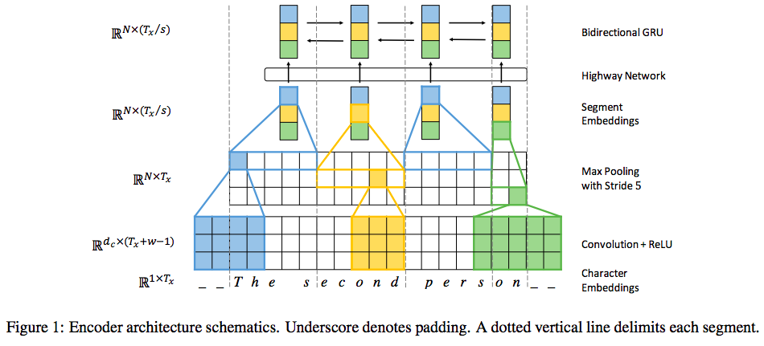
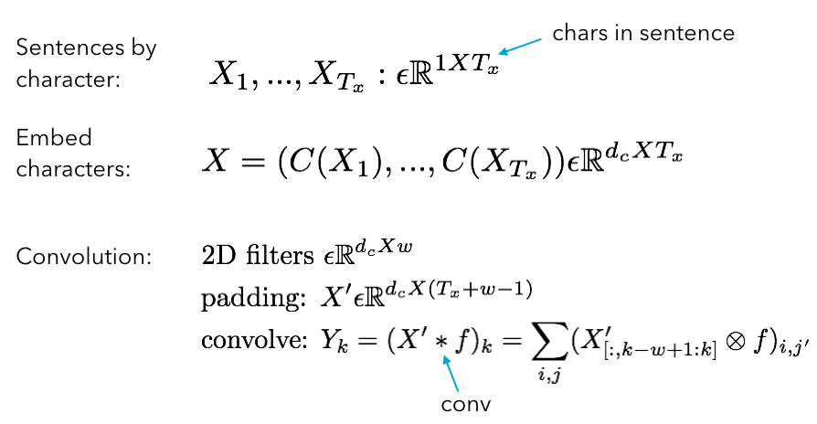
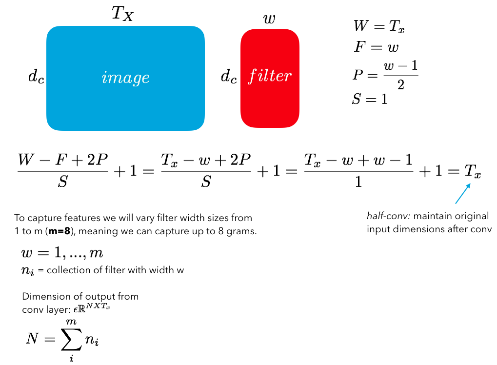
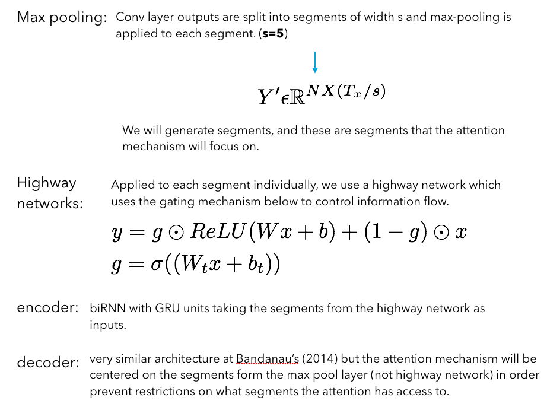
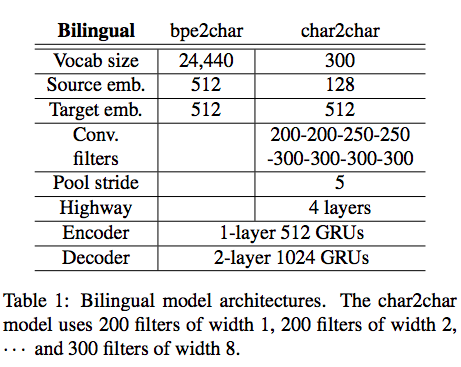
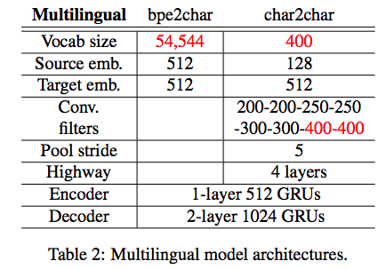

## - [Fully Character-Level Neural Machine Translation without Explicit Segmentation] (https://arxiv.org/abs/1610.03017)

TLDR; A character level approach for NMT proves to perform REALLY well compared to word level models.

### Detailed Notes:

- most NMT models in the past have been word level because the word is the basic unit of meaning for us. Additionally, char-level models will require more computation per sequence than word-level models.

- With the fully char-level model, an input source sequence in to be translated to the output target sequence. To dramatically reduce the size of the input sequence, convolutional and highway layers are used. 

- Main advantages of char level models:
	1. no out-of-vocabulary issues for predictions
	2. can model different morphological variants of a word
	3. no segmentation into words required, which is something we do manually
	4. multilingual performance since diff vocabs not required for each langauge
	5. model can learn it's own representations for sentences (instead of forcing words)

- predicted of target chars is now computationally cheaper compared to word predictions (bc num chars <<< num words). But now our attention mechanism is costly because the input sequence annotations will be much longer than the word-level alternatives. So the main goal will be to reduce the length of the input source sequence (convolution + highways). 

- 

-  An in-depth look at the architecture/data flow:

- 
- 
- 

- Model features for bilingual and multilingual tasks:

- 

- 

### Training Points:

- minibatch size: 64 with adam optimizer (lr=0.0001)
- GRU used
- data scheduling: do different languages for the multilingual part in order to prevent overfitting to one source language.

### Unique Points:

- char-level is great for multilingual models (translating from many languages to one), because we are no longer constricted to a word vocabulary. 

- AMAZING performance that can capture rare words, once occurring words, spelling mistakes, etc.  

