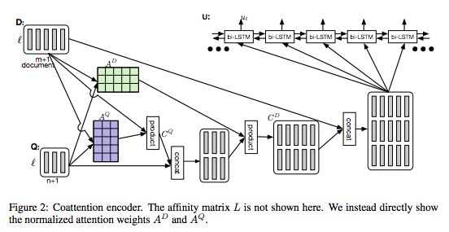
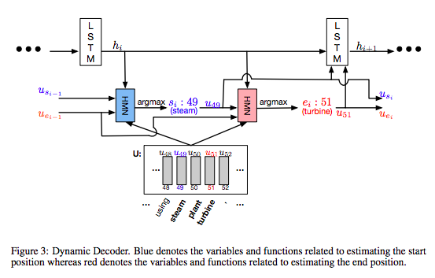
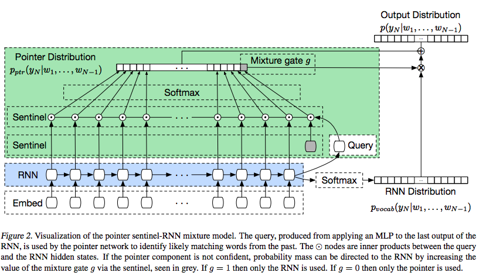
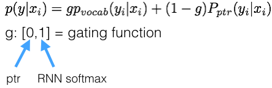
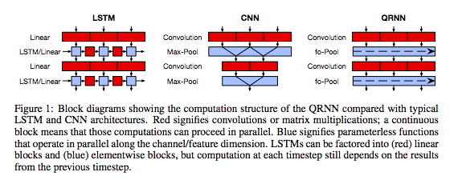

## [Highlights and Tutorials for Concepts Discussed in Richard Socher on the Future of Deep Learning](https://www.oreilly.com/ideas/richard-socher-on-the-future-of-deep-learning)

**Raw interview**: https://www.oreilly.com/ideas/richard-socher-on-the-future-of-deep-learning . I highly encourage listening to the podcast because the questions were so well crafted. 

TLDR; Richard Socher of Salesforce (formerly Stanford and MetaMind) offers insight into the current and future states of deep learning used for NLP. 

**Disclaimer**: This is my interpretation of the interview. I have included the pertinent questions I found interesting.

**Q**: Tell us about the kinds of problems you?re thinking about these days at Salesforce.

**A**: Socher?s goal is to push the state of the art in AI through research and then make it widely and easily accessible. We need to push the boundaries of language understanding by using deep learning. He believes that question/answering task can be used to frame a lot of the NLP problems into. This means that we need a system that can build on top of other tasks and keeps getting smarter as you add new tasks to it. 

The long term research goal is a joint multi-task learning where a single model keeps growing in intelligence. Right now, we are really good at developing models for a single task and optimizing for it, but that?s not how humans learn. We learn continuously and don?t forget old tasks when encountering a new one.

**Q**: In the last couple years, text is the new image, in terms of areas of tasks that are receivng the most attention.

**A**: We have lots of complex image related tasks left but we have mastered the standard object recognition task quite well. NLP is super exciting now due to deep learning in language processing. There are a myriad of datasets and not one ?ImageNet? like dataset for NLP tasks which poses an exciting opportunity. 

**Q**: For Q/A tasks, can we incorporate common sense and context into these systems?

**A**: Encoding common sense logic is really difficult. There is factual encoding which involves incorporating ground truth principles for a system vs. fuzzy encoding which can involve subjective aspects that the model needs to account for and it?s hard to encompass all this information. 

**Q**: Will the AI enable Q/A systems as a platform that can understand questions and then add on modules that can answer different kinds of questions or will it inherently be able to learn and add on new capabilities.

**A**: There will be a transition. We will start with a simple Q/A platform that will be able to answer some common types of questions (almost like a classification system) and then after a while, we can move onto more complex conversational free-form answers to arbitrary questions. This is the future and where we want to be. If it's a conversational system, speech may not be the best way to present things. (ex. listening to lots of options for a given question). So we need some visual components to help the conversational aspect. (West World anyone?)

**Q**: Details on the new [Dynamic Coattention Networks](https://arxiv.org/abs/1611.01604) which uses the question and the input information in order to answer the question. 

(I have detailed the Pointer Sentinel model in my [blog post](https://theneuralperspective.com/2016/10/04/pointer-sentinel-mixture-models/)).

**A**: The model in the paper is currently #1 in the Stanford Q/A dataset [(SQuAD)](https://rajpurkar.github.io/SQuAD-explorer/). The model reinterprets the question in light of the document and then reinterprets the document in terms of the question. 

The model also uses a dynamic pointer decoder, which outputs a range of two points (beginning/end) and the answer are the words in between these two locations. 

Limitations of the this pointer decoder include not being able to answer simple yes/no questions but Stephen Merity?s paper on [Pointer Sentinel Mixture Models](https://arxiv.org/abs/1609.07843) is all about combining pointers with softmax/classifiers to address this limitation.

In the paper, pointer networks were used to predict the next item in a sequence based on context. Traditional softmax classifiers cannot usually give rare words or names as appropriate outputs when they are in fact the correct outputs. Pointers can help solve this issue by puling the output from the inputs. 

Merging will lead to a well performing model, but was not required for SQuAD because each answer lies as a sub-phrase in the input document. Dynamic because we can do multiple passes on the input and correct its answer after each pass. 

**Q**: Details on the [Quasi-Recurrent Neural Networks](https://arxiv.org/abs/1611.01576).

(I have detailed the QRNN in my [blog post](https://theneuralperspective.com/2016/12/16/quasi-recurrent-neural-networks/)). I will have a tensorflow implementation soon as well.

**A**: Parallelism is a very powerful concept in deep learning but we cannot incorporate directly for RNNs because subsequent output depends on previous output. The QRNN is able to parallelize in the time step dimension and feature dimension. 

**Q**: ML community is very open and everyone is sharing research, code, etc. which is quite different from some other research communities. Are you using frameworks like Tensorflow, Keras, etc. or using your own in-house frameworks?

**A**: People like Yoshua Bengio and Yann LeCun being very open with their research many years ago has made the community to be open as it is today. Now anybody can go quickly go from model to what that model can do in real life using a lot of these open sourced frameworks. This lowers the bar for developing new AI models. Socher was hoping that everyone at Salesforce would use Tensorflow, but many people (who want to use multiGPUs for large datasets and tf didn?t support at that time) used [Chainer](http://chainer.org/).

Tensorflow is great for using existing models and recombine them in interesting new ways but Chainer allows to have very simple if statements and switches inside the training and testing code so that depending on the input, we can have different computational graphs which allows us to push outside the boundaries of existing models. 

**Q**: Lot of people are able to reimplement/tweak existing models due to there large open sourced frameworks but very few people are able to come up with their own new models. Do you see something in the horizon that will allow people to write models from scratch and really understand the models at a fundamental level.

**A**: The boundary with math and good programming will always be massive hurdles to cross. But you see all these new groups emerging and making a mark in the community.

**Q**: Now that you?re at Salesforce, how are you thinking about building datasets for text?

**A**: We have some good bilingual datasets for machine translation. Datasets are very important for enterprise and consumer world, as well as research. Companies like Google cannot release their most exciting datasets due to privacy. 

**Q**: How do deal with text datasets that don?t really reflect how we communicate. (Ex. Wikipedia is very formal compared to emails/text).

**A**: We can train the model on different datasets (ex. Smerity?s pointer sentinel model was trained with a refined wikipedia dataset and a twitter dataset). The goal is to have one model that can handle a variety of datasets. Socher found that models break very quickly if you try to do this but we need to make adjustments to be able to do this.

**Q**: All these models are trained on static datasets but eventually we will have to use online sources in order to continuously learn. At that point, how do you prevent the AI from making mistakes or from doing something it wasn?t meant to do?

**A**: It is a fundamental problem as AI incorporates in our lives at an increasing rate. How do we prevent semantic drift and prevent systems from going unchecked. Since these systems are so dependent on training data, if the data itself it biased, then the model will be biased. We need to have systems that are not biased.

**Q**: What do you think about AI generated context (news. etc.) based on optimization for some end goal (engagement, etc.)?

**A**: Regulation is highly needed for successful AI in order to vet poor/undesired results. We have to separate fundamental research and how it is applied. When it is applied with our lives, we need to have strict regulation. 

**Q**: What are the big unsolved problems that are getting you excited?

**A**: The biggest one is joint multi-task models. Figuring out a single Q/A model that can do many things like translation, Q/A based on complex world states, summarization, etc.. We have all these different problems and we don?t have a model that can do all of these tasks. The reason we need one model is that we will be able to learn high/low representations of the tasks which will prove to be beneficial for solving all the other tasks. A few issues are things like skewed datasets for the different tasks,. For all these tasks, we would like to have transfer learning as well but this is difficult with many tasks that aren?t related. Which also gives rise to catastrophic forgetting and interference which hurts a bit when trying to train a single model on multiple tasks because now the output space is significantly larger and now you have bigger chance for making misclassifications, etc. 

**Q**: How do we make the models more intuitive? How can we anticipate how they will behave and diagnose outputs? How can we make the models more transparent.

**A**: We are getting better at understanding our models. We use techniques like BPTT, attention scores (to see what part of the input the model is actually focusing on for different tasks). You can also see how neurons behave for inputs. But it is still complex (esp. for text), it will be difficult to understand the answer (even for the way humans would process and answer the question). Right now, especially in finance in medicine, the tradeoff between accuracy and interpretability is key. 

**Q**: How far off are chatbots and conversational agents from being practical for business applications?

**A**: "Fake it until you make it." You want the human to do a certain task (faking it) and you take that input and AI learns from this (make it). Slowly you take out some of the pain and allow the AI to offer solutions and optimize. We will see more and more aspects being automated which will really allow the backend person to add a personal touch to the conversation with the customer. Biggest use case will be in service, where you have a specific question and we want to get a quick answer. There are also opportunities in marketing (purchase decisions) and FAQ/knowledge base to answer baseline questions.

### Pertinent tutorials/breakdowns:

[Attentional Interface](https://theneuralperspective.com/2016/11/20/recurrent-neural-network-rnn-part-4-attentional-interfaces/) (Implementation included)
[Pointer Sentinel](https://theneuralperspective.com/2016/10/04/pointer-sentinel-mixture-models/)
[QRNN](https://theneuralperspective.com/2016/12/16/quasi-recurrent-neural-networks/) (TF Implementation coming soon)

