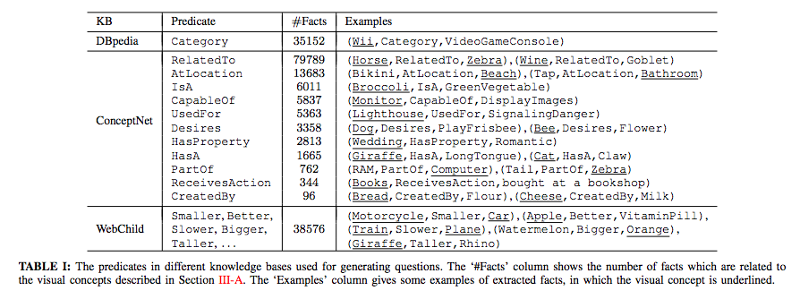
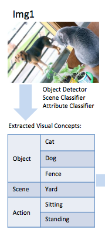
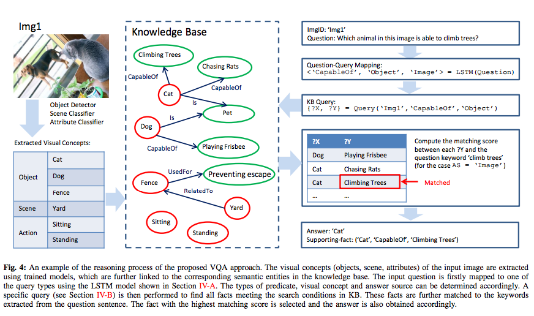
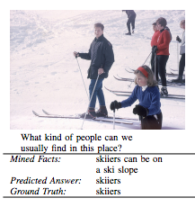

## - [FVQA: Fact based Visual Question Answering](https://arxiv.org/abs/1606.05433)

TLDR; Architecture that can use an image to answer questions that cover the scope beyond just the information presented in the image by using supporting knowledge. These facts are automatically found from large-scale structured knowledge bases (KB). 

### Detailed Notes:
- Current visual question-answering (VQA) models can answer question relating to image classification, object detection and recognition very well. However, questions beyond this scope do not produce good answers. This is largely due to that fact that the only information available comes from the images. A nice example is being able to ask 'How many giraffes are in an image?' and the answer being based off of without really knowing anything about giraffes. 

- Most of the question that can be answered with just the image include physical attribute based questions such as color, number and physical location. This limitation does not allow us to classify the model as "AI-complete". If we were to look at an image and a question was asked, we would reason about the objects in the image but also use prior knowledge about those objects to properly answer the question. 

- This paper developed a dataset and model that uses structured knowledge bases to gather supporting information for a given image. Together, with information from the image and the supporting fact, we can answer a wide variety of questions. The paper considered all questions that can answered only with an external source of information.

- Theoretically, we could answer questions beyond the visual scope if we have a very large number of images that corresponds to every single important word in a query. This would be a very difficult endeavor and we would be reinventing the wheel here since we already have sources for facts.

#### Structure of the Supporting Fact
- The supporting facts need to be structured in order for any model to be able to make use of them. The facts from the paper come from existing knowledge bases and the form is a triplet from a large interlinked graph (arg1, rel, arg2), which signifies the relationship between two arguments. The information in our KBs can be easily processed using a query language. The authors used SPARQL to query the RDBMS. 

- Here are a few examples of the triplets:

- Having triplets allows us to represent mutual relationships between objects/concepts. This creates an opportunity for the model to make stronger representations since we are factoring in the structural representation. I would take this even one step further, and for the concepts that do not have as much information, we can create a hierarchical fall back as well (GRAM).

- All the questions in the dataset can only be answered with both the image and some commonsense knowledge. A custom dataset was created by allowing users to choose images, visual concepts in the image and supporting fact(s). 

#### Image and Visual Concepts
- The information we extract from the image itself is very important since we need it to actually extract valuable supporting facts from a knowledge base. Fast-RCNN and similar models are used as object detectors, scene classifiers and attribute (action) classifiers.

- An example for an image is as follows:

#### Knowledge Bases
- KBs are usually constructed by manual annotation (DBpedia, Wikipedia, etc.) or automatically extracted from unstructured/semi-structured data (WebChild, ConceptNet, etc.). The paper uses DBpedia, Webchild and ConceptNet.

- DBpedia is extracted knowledge from wikipedia with concepts tied to categories. The data was extracted via crowd sourcing. ConceptNet is automatically generated from the Open Mind Common Sense (OMCS) project. WebChild is also automatically extracted from different sources on the web.

#### Question Collection

- A lot of work went into collecting the questions as they required also collecting proper supporting information from the KBs. The different steps include selecting the main concept in the image (object, scene or action). And then selecting the fact that is associated with the concept in the image. Finally, a question is asked and answered using the supporting information and the image. Note that the question is formulated with the supporting fact, as this is easier since we need to use a fact from a KB. An additional layer of testing was used to validate the dataset in order to truly determine that the question requires both the image and common sense/ knowledge to answer and that the supporting fact actually offers that missing knowledge from the image. 

- One aspect that was not so clear in the paper was that, during question synthesis, a bunch of facts (not all) about the main concept in the image were presented to the annotators. They they had to come up with a question using the image and the supporting fact. During inference, we have the image and we parse the KBs looking for ALL of the related supporting facts. We then have to determine which of these is relevant using the image and question. 

### Training

#### Question-Query Mapping

- The authors decided to map any possible question to a set of queries. Each question can be broken down into the following properties: visual concept (VC), a predicate (REL) and an answer source (AS). We can map any question to one of the 32 possible query types (listed in Pg. 14. Table. XIV). Here is how the process works:

#### Answering by Querying KB

- Once we have mapped the raw question to a query (out of 32 possibilities), we can work on constructing a KB query: {?X, ?Y} = Query(ImgID, REL, VC), where ?X is the specific concept (cat, animal) of type VC (object, scene or action) and ?Y is the concept in the KB that is linked to ?X via the REL. Let's walk through the example:

- Let's take a closer look at some of the potential knowledge the model received:

- In our example above, the query returns knowledge based on the objects in the image that are CapableOf doing something (not just climbing trees) and the objects in the KB also have to pass the three checks. Once we get all the relevant knowledge from the KB, we need to determine which of the facts will let us answer the question. In order to determine the answer, we first need to determine the source of the answer (IMAGE or KB). We can do this by feeding in the question into an LSTM and classifying it.

- For our cat, dog example, we can see that the answer source (AS) comes from the image since we want to know which of these animals (in the image) can climb trees. An example with the same image, where the AS will be a KB is a question like 'Which type of animal is usually seen sitting on a fence?'. Weird example, I know, but I've seen a lot of cats just relaxing on fences. There are better examples in the the appendix.

- Once we determine what the answer source is, different strategies are used to determine the ultimate answer. If the AS is IMAGE, the KB concepts (?Y) wll be matches to the keywords extracted from the question (throwing out stop words). These facts are then accessed with a matching score (Jaccard similarity) to the question keyword "climb tress'). Here is the entire reasoning process for this AS:

- If the AS is KB, separate classifiers focusing on scene/action or location of the object, along with key words from the question are used to determine the answer. 

- There's quite a bit on the model performance at the different stages (QQ mapping, etc.) so I suggest thoroughly reading those sections. And now here is a better example of an AS that is KB:

### Unique Points:

- One limitation (that stems from the question formulation procedure), is that an answer is only based off of one piece of common sense. It would be interesting to see different pieces of knowledge from the KB being used to answer a more intricate question.

- The focus on using automatically generated KBs is really nice because we can isolate these qa platforms to specific domains with knowledge extracted from APIs, etc. (A few startups already working on this.)

- Would like to see the database of images and questions used since this is quite a rare dataset.

