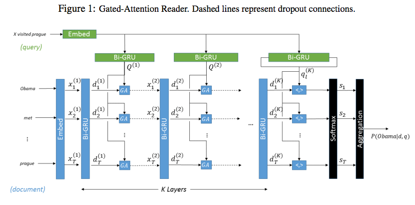
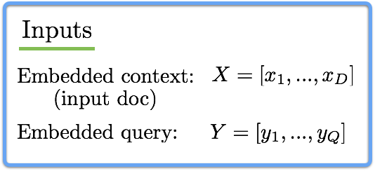
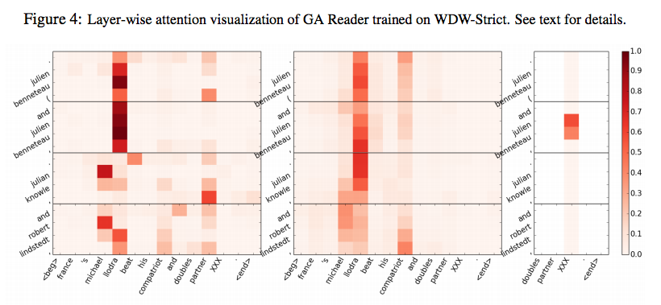

## - [Gated-Attention Readers for Text Comprehension](https://arxiv.org/abs/1606.01549)

TLDR; The Gated-Attention (GA) Reader uses a multi-hop architecture to build query specific representations of the tokens in the document. 

### Detailed Notes:

- The multi-hop architecture allows the model to scan the document and query for many passes. Attentional interface(s) are used on top of this to focus on parts of the context (document).

- The model uses multiple attention layers for each pass in order to create a fine-grained attention that allows for each context token to have query-aware representation, leading to accurate answer predictions. 

- GA reader uses gated-attention which uses the outputs from a GRU to devise the attention scores. Note: this is different from the attention-based GRU from the DMN+ model. In the DMN+, attention replaced the update gate in the GRU in order to incorporate fact (sentence) ordering with attention, which was crucial (especially for some the temporally associated babI tasks). Also, recall that with DMN+, we generated attention scores for each fact for a given input. However, here in gated-attention, we use all the words in determining the attention (like regular soft attention). But the unique aspect is that our input to the attentional interface are from a GRU and we apply the attentional interface multiple times (K times).

- As a refresher, here at the steps for a bi-directional GRU, going from some input X to a concatenated output H.

#### GA Reader:

- The input document (context) and query are embedded. D is the total number of words in the document and Q is the total number of words in the query.

- These inputs are used in the multi-hop architecture. The input embeddings (X) are used as is for the first layer of the GA, but then get transformed for the subsequent X inputs. The same Y is used for each input into the GRU_Q.

- We take the inner product of Q and each word in the doc d_i to get attention scores. We use these scores to compute tilde(q_i) which is a token specific representation of the query. We receive our new x_i by taking the element wise product  of the token specific query vector with our token d_i.

- And finally the answer is determined by taking the intermediate output of the final layer query Bi-GRU at location l (which is the cloze token location in the query). We take the inner product of this vector and our processed D^{(K)} (which is the full output of the final layer document Bi-GRU). We then compute the probability of each of the candidate tokens by normalizing over all the candidate tokens and choosing the argmax. 

### Unique Points:

- The paper also mentioned adding character level embeddings. This proved useful for dealing with OOV tokens at test time. Something unique to note is that they did not use a traditional CNN for char level embeddings as many papers do (BiDAF, etc.) but instead, they use a simple Bi-GRU to process the char tokens and come up with a representation. The paper also tested out the Question Evidence Common Word Feature (which added questionable performance boost depending on the dataset). 

- The attentions at multiple intermediate layers allows us to do ablation at all the stages. I think this type of intense ablation is important for these models and just a shallow attention analysis at the beginning of the model.

- The ablation studies were quite convincing but I wish we could see the ablation results for more (or all K) layers of the GA Reader. I MAY implement this soon and will post the attention scores at all layers. I want to see if there is a drastic change throughout the hops. 

- I'm not particularly a fan of the QA datasets used in this paper. The cloze style (fill in the blank) types of questions have the advantage where using something like n-grams won't work but these types of questions are not reflective of most of the QA I would use on a daily bases. The SQuAD dataset would have been a nice addition and the dataset was available at the time of publishing (as many other paper before and after this one tested with it), so it's interesting to note its absence. But we can fix that with our own implementation soon ;)

