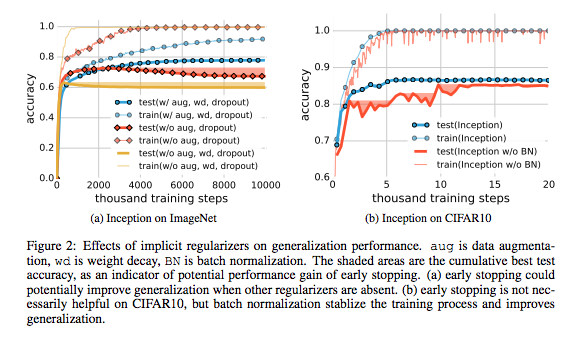

## - [Understanding deep learning requires rethinking generalization](https://arxiv.org/abs/1611.03530)

TLDR; Even very large, deep networks can have small generalization error (difference between training and test performance). The cause of this is usually attributed to model architecture and/or regularization techniques. However, this paper states that these approaches fail to explain the real cause of the small generalization error.

### Necessary Background

- Rademacher Complexity: A complexity measure of a certain hypothesis class H on a dataset (X_1, ...X_n). The complexity measures, on average, hypothesis class H's chance of fitting all the possible label assignments in the data. In the randomization section below, we will use this complexity with our DNNs to prove that this complexity is not enough to account for the success of such large models.

- Uniform stability: a measurement that shows how sensitive a particular model is to replacement of a single data sample. It is important to note that this is only an attribute of the model and not of the data itself. 

### Detailed Notes:

- Deep Neural Nets (DNN) often have more model parameters than training samples. However, many of today's state of the art models are still able to show extremely small generalization errors. 

#### Randomization:

- The first notion is that "Deep neural networks easily fit random labels". Essentially, we can make any group of inputs fit to any group of outputs and achieve ~0 training error. This allows us to conclude that a large enough DNN can simply use brute-force memorization to fit the data.

- Even with various levels of randomness in the data, the model is still able to fit. The generalization (test error - train error) starts to increase as the amount of noise in the randomization is increased. This means that the model is learning to recognize what ever signal remains in the data and use memorization to fit the noise. 

- Several levels of randomness were tested with the data and the network was always able to fit completely during training. However, the objective function took longer as more randomness was inserted. This is mainly due to large errors that are back propagated resulting is large parameter updates via the gradients. 

- One thing to note in these experiments is that this is just a data change. The paper uses this randomization experiment to rule out possible sources of explanation for successful generalization such as the Rademacher complexity and uniform stability. 

- We can rule out complexity measure like Rademacher since our model fits perfect to the training data (therefore, R(H) = 1). We can no longer use uniform convergence boundaries as a means to explain the low generalization error. And we can't use stability measures either because this change is to the data and not any of the model parameters. 

#### Regularization:

- The second notion is that "Explicit regularization may improve generalization performance, but is neither necessary not by itself sufficient for controlling generalization error". The paper generalizes regularization techniques as a tuning parameters that helps with generalization but is not required for low test error. A nice way to think about the role of regularization is to think about the entire hypothesis space. By using regularizers, we are essentially decreasing the possible hypothesis space to a smaller subset. 

- The paper experimented with three types of explicit regularization: data augmentation, weight decay and dropout. The authors found that data augmentation and weight decay helped decrease the test error but even if they were not used, the models were still able to generalize well. (Note: augmentation was found to be considerably more helpful compared to weight decay aka data is the best regularizer :) ).

- The authors experimented with various forms of implicit regularization as well, such as early stopping and batch normalization. For both of these techniques, there was only marginal decrease in generalization error with the absence of such techniques. This allowed the authors to conclude that it is "unlikely that the regularizers are the fundamental reason for generalization".

#### Finite-Sample Expressivity:

- One proof I really enjoyed from the paper was for the theorem that "there exists a two-layer neural network with ReLU activations and 2n+d weights that can represent any function on a sample of size n in d dimensions". The proof can be found in the appendix of the paper.

### Takeaway:

- We need to really understand how to create these DNNs that can generalize well, not just for better interpretability but for "more principled and reliable model architecture design". The proof for theorem one goes to show the memorization power of deep neural nets and the potential for misguided manipulation. I personally would like to research further into this for interpretability sake because I believe figuring out what contributes most to excellent generalization will allow us to create more sound models. 

- I think the authors did a great job in introducing the topic and guiding us to rethink generalization. For current SOTA models, I think model architectures that have empirical and intuitive reasoning are large part of excellent generalization performance. It would be interesting to experiment with different levels of complexity (in terms of architectural interfaces - attention, information flows, etc.) and note the performances. 

