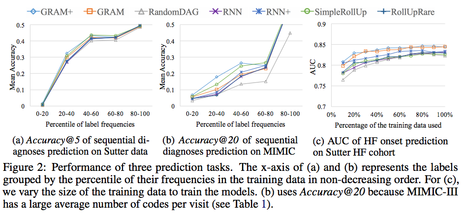
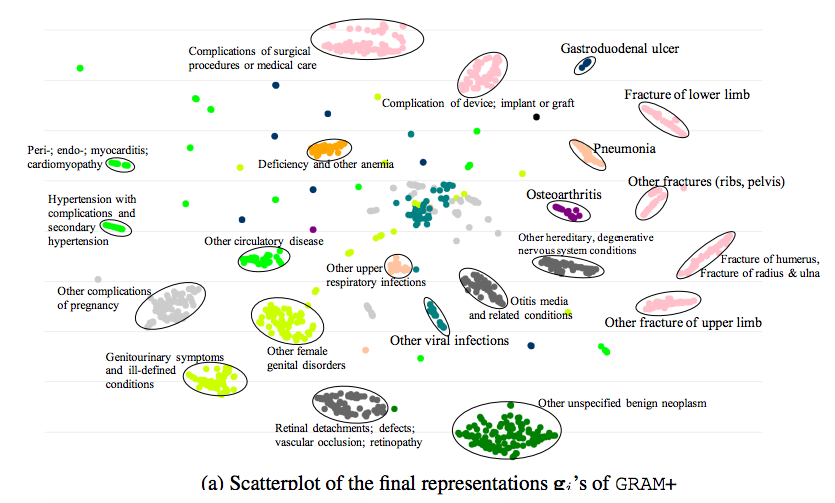
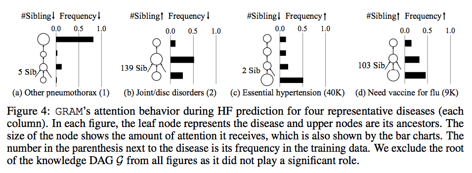

## - [GRAM: Graph-based Attention Model for Healthcare Representation Learning] (https://arxiv.org/abs/1611.07012)

Reason to Read: We have all seen use cases of deep learning in medicine, especially in tasks were image processing is involved:

> [Deep Learning Algorithm for Detection of Diabetic Retinopathy](http://jamanetwork.com/journals/jama/article-abstract/2588763)
> [Deep learning algorithm does as well as dermatologists in identifying skin cancer](http://news.stanford.edu/2017/01/25/artificial-intelligence-used-identify-skin-cancer/)

But we don't really see much progress with combining textual data sources (ie. electronic health records (EHR)) which seems strange since we generate these records on every single clinical visit. Some of this can be attributed to privacy concerns but lately, we are seeing an increasing amount of large, publicly available clinical databases. A few of my colleagues and my old professor have been steadily making progress with using deep learning with clinical records to draw out insights that can drastically aid the field. Implementation is below along with public access to the datasets.

TLDR; Data insufficiency and interpretation are two common issues when using deep architectures. This is especially true for a lot different healthcare related tasks where these two issues cannot be overlooked. This paper introduces the GRaph-based Attention Model (GRAM) which uses an attention mechanisms to represent medical concepts.

### Detailed Notes:

- The objective of the models discussed in this paper is to take clinical event information from a patient's health record and predict the events that will occur in the next visit. These events could be a multiple of different things but one common attribute are the International Classification of Diseases (ICD) codes from each clinical visit. 

- Data insufficiency in terms on electronic health records (EHR) occurs in the form of limited data samples for a particular rare occurrence (disease, condition, etc.). Since we do not have enough data, it is hard to develop useful representations for these events to receive accurate predictions.

- Interpretability is the other issue, especially with health related tasks, because it is very important to know why predictions are as they are. It is important that the representations these deep models ultimately converge to are highly correlated with our medical understandings of those inputs. 

- The paper uses medical ontologies (hierarchies of medical information where one ICD code can be a parents and a children of other parent nodes) to encode the inputs. This incorporate of this medical ontology information helps the data insufficiency issue by reducing the number in input features needed to be assessed. So if you think of the model training as learning how to classify many different types of input combinations (say for a particular disease), if the disease does not have much data, this will be a difficult task. But by using the hierarchal information for the disease, we are able to retrieve more information abut the diseases and it's parents. These parents will be the parents of other diseases as well, which now gives us some more useful information to encode about our rare disease. 

- The GRAM method infuses the medical ontologies into the encoding process by using an attentional interface. I don't think I can say it better than the paper can for how they use this information to create representations: 

> "Considering the frequency of a medical concept in the EHR data and its ancestors in the ontology, GRAM decides the representation of the medical concept by adaptively combining its ancestors via attention mechanism." 

The intuition is that when a medical event lacks enough data points, more weight is given to the ancestors of that event (parent nodes), since they can be learned better (since data exists for them via other child events). This effectively solves both the issue of data insufficiency and interpretation. 

#### Representations via GRAM:
- Now we will discuss the details of how the authors decided to embed each of the patients information.

- The codes (ex. ICD codes) are all represented by a set C and the clinical records of each patient is represented by V (for T visits), where each visit V_t is composed of x_t which is a binary result for each code (wether or not is given for that clinical visit). 

- Now we need a way of embedding the codes for each visit. A paper uses GRAM to incorporate the medical ontology information in the embedding procedure.

- We take the embedding matrix G to embed the visit into V_t into v_t, which will be used in the end to end architecture. The embedding involves doing a matmul of G and each x_t and applying a tanh nonlinearity. Then for each v_t (which represents an embedded visit), we feed into an RNN whose output is used with a softmax operation. So the predicted y (yhat) has \mathcal{C} items where each item is the change of that code appearing for the next visit. We use this with a binomial cross-entropy loss (since ground truth is also \mathcal{C} items but with binary values). This is repeated for each t in V_T visits. (Ex. V1 used to predict V2, V1 + V2 used to predict V3, up to V1 + ... V_T-1 to predict V_T). 

### Unique Points:

- Paper uses publicly available data (Ex. MIMIC-III dataset) which allows us to reinforce the results. However, we wary of the large data, as it contains ICU events for ~7,500 patients over a 11 year period. I recommend playing with Scala to understand the data a bit before implementing any prediction tasks.

- GRAM was tested against recurrent architectures and different initialization schemes to represents the medical ontology. The results were quire impressive even for accuracy @5 and @20 considering the number of clinical class code groups. 

- Paper also plotted some scatterplots of the final representations to see if they are consistent with medical ontologies. You can see that the attention was able to incorporate the ontologies well as similar classes of clinical codes form clusters. 

- The authors also conducted a study of the attention behavior for ICD codes that have lots of events associated with them and ones that do not. We expect that when the data is low for a particular clinical event, more attention will be given to the parents since that will allow us to better represent the clinical code. Figure 4 confirms our hypothesis by showing the amount of attention the leaf and parent nodes receive. In the diagram, (a)'s leaf is rarely observed, a few more events available for (b) and plenty of clinical events available for leaf nodes (c) and (d). 

### Takeaway:

- I think the GRAM interface proposed by the authors has a lot of merit. Data insufficiency is a major deterrent when it comes to using health records to garner insights. Using medical ontology to mitigate this issue and incorporate valuable clinical information that aligns with medical expectations offers a powerful representation. Though, we still have quite a long way to go before we use clinical records to give direct actionable insights to professionals, artificial intelligence is helping make leaps towards that goal.

### Code
- [Theano Implementation](https://github.com/mp2893/gram)
- [MIMIC-III](https://mimic.physionet.org/)
- [Interactive Visualization](https://jkulas12.github.io/GRAM_Visualization/)

