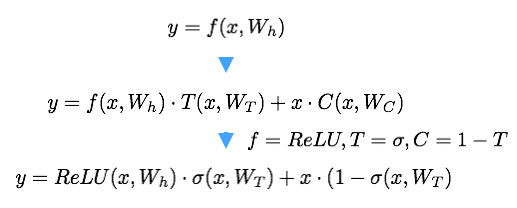
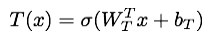
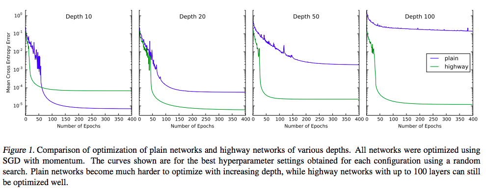

## - [Highway Networks] (https://arxiv.org/abs/1505.00387)

TLDR; We need deep networks for better results but also for computational and statistical efficiency. But they are difficult to train/optimize, so we should highway networks which use a learned gating mechanism for regulating information flow.

### Detailed Notes:
- Depth of neural networks is crucial for learning intricate patterns but training/optimization becomes difficult with increasing depth. Highway networks allow us to regular flow of information through the network.



- T is the transform gate (how much of the transformed information do we take to the next layer) and C is the carry gate (how much of the original input do we carry into next layer).

- Optimization of highway networks is almost independent of depth. The above shows us that the highway layer can smoothly vary between a plain affine layer and a layer that just lets its inputs through. Obviously, since T is sigma, which is bounded to (0,1), we would never face either of these extremes but instead we will have a balance between them.

### Training Points:

- The bias vector in the transform gates can be initialized with negative values. This means that the network is initially biased towards the carry gate (C). This was found to help bridge long-term temporal dependencies early in learning.



- Highway networks converge significantly faster than plain networks.



### Unique Points:

- Very similar to the information flow control in LSTM gates. Now we just apply it to any network layers for efficient training/optimization.

### Implementation
```python
def highway_network(x, num_hidden_units, nonlinearity, transform_bias=-1.0):
    """
    Implementation of highway network.
    (https://arxiv.org/abs/1507.06228)
    Nonlinearity is assumed to be ReLU,
    if tanh or sigmoid change weights initalization to 1.0/sqrt(n).
    """
    W_H = tf.Variable(tf.random_uniform(
                [num_hidden_units, num_hidden_units],
                -np.sqrt(2.0/num_hidden_units),
                np.sqrt(2.0/num_hidden_units)), name="W_H")
    b_H = tf.Variable(tf.constant(0.0, shape=[num_hidden_units]), name="b_H")

    W_T = tf.Variable(tf.random_uniform(
                [num_hidden_units, num_hidden_units],
                -np.sqrt(1.0/num_hidden_units),
                np.sqrt(1.0/num_hidden_units)), name="W_transform_gate")
    b_T = tf.Variable(tf.constant(transform_bias, shape=[num_hidden_units]),
        name="b_transform_gate")

    H = nonlinearity(tf.matmul(x, W_H) + b_H, name="affine")
    T = tf.sigmoid(tf.matmul(x, W_T) + b_T, name="transform_gate")
    C = tf.sub(1.0, T, name="carry_gate")

    y = tf.add(tf.mul(H, T), tf.mul(x, C), "y")
    return y
```