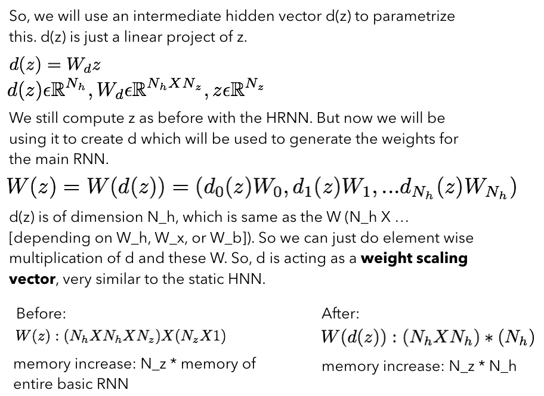

## [HyperNetworks] (https://arxiv.org/abs/1609.09106)

TLDR; The approach of using a smaller network (the hypernetwork (HN)) to generate weights for a larger network (main network). This will offer a feasible alternative to weight sharing because the HN will generate non-shared weights while requiring a just a few additional learnable parameters.

### Detailed Notes:

- The main network behaves normally (take some inputs and map to desired targets). However, the HN will take some inputs that contains information about the structure of the weights and create the weights accordingly for a specific layer.

- An obvious advantage is the ability for the HN to generate dynamic embeddings vectors. So now the weights of the RNN can change dynamically with time step and depending on the input sequence.

- CNN has very little weight sharing which becomes a problem when you have large deep models with many parameters. So goal of HN for CNN will be to increase weight sharing which will keep the total number of parameters down.

- RNN has too much weight sharing. Same set of weights are used across each state (such as W_hh, etc.). Goal of HN will be to decrease the weight sharing so we can have a more expressive model but we also need to keep the number of parameters low. 

- Static HN for CNN:

- The objective is to generate the kernel (filter weights) for each conv layer using fewer learnable parameters. For a traditional CNN, going from one conv layer to another will require a kernel of size (N_in f_size X N_out f_size) but by using a HN we can create kernels with the same dimensions but by using much less parameters. 

- The static HN (2 layer NN) has it's own set of weights that will take in an embedded input z (unique for each conv layer) and will generate our kernel. The HN weights and z are learnable parameters and the HN weights are fixed for all conv layers. So now we can still have unique kernels for each conv but by using the same HN weights to generate each one based on the input z. This allows us to do a bit more weight sharing but much less parameter expense. 

- Also, if N_in != N_out, as is the case with practical image processing in the conv layers, we will have to do a little trick. We will have to concatenate smaller kernels in order to create the non-square kernel that we need.

- it's called static HN because the same z^j is used at conv layer j during training and inference. For RNNs, we will need a dynamic z^j that can change during inference depending on the input sample. This will allow some relaxed weight sharing compared to the original no weight sharing 

- Dynamic HN for RNN:

- Goal is to generate a different set of weights at each time step and for each input sample. 

- At each time step for each input sample:
	1. We will concatenate the input sample and the hidden states of the main RNN.
	2. The HyperRNN (HRNN) will use this to generate a small signal vector.
	3. This signal is used to generate the weight vector for weights for the main RNN.
	4. Both main and HRNN are trained end-to-end.
	
- 

- 

- For calculating the z signal vectors, we will use HRNN as a function of x_t and h_{t-1}.

-  

- One problem here is when generating the weights for our main RNN (weights dot product with z), we need N_z times the number of weights needed for a basic RNN. This is a lot of computation that will limit the number of hidden units we can have. 

- Let's break this down:

	-  
	-  
	
- We can apply a similar architecture as HRNN to LSTN units to make a HyperLSTM (HLSTM). Details on this in the paper but very similar to this approach above.

### Training Points:

- HN play well with batchnorm and layernorm and share some similarities as well, such as in the formulation of the HRNN. 

- Performance on language tasks (penn treebank, huttzer prize wiki) was better than regular recurrent structures. 

### Unique Points:

- Non-shared weights for an LSTM generate by the HN performed better than the standard LSTM rnn model.

- The kernels generated by static HNN look a bit odd compared to regular conv filters. The performance is also a little poor on some of the standard datasets. 

