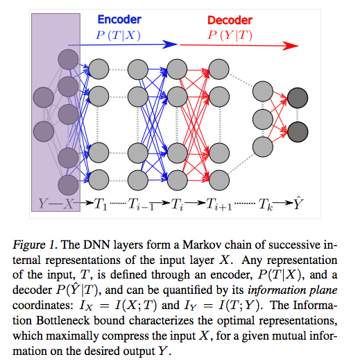
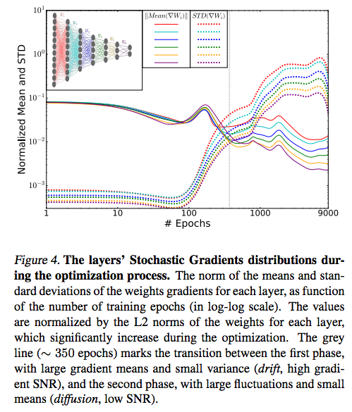
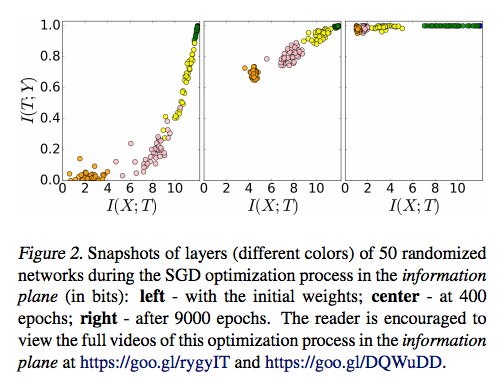

## - [Opening the Black Box of Deep Neural Networks via Information](https://arxiv.org/abs/1703.00810)

TLDR; Stochastic gradient descent (SGD) has two unique stages; empirical error minimization (ERM) and representation compression. This paper explores these stages in an attempt to justify the success of deep learning.

### Introduction:

- It's easy to see how DNNs form a Markov chain, so the paper explores viewing DNNs with an information lens. We can consider each component in the network via an information plane, which holds the mutual information of a given variable with the input variable X and the output variable y. 

- The main goal of our DNNs is to learn a representation of the input data using some samples from a joint distribution P(X,Y) and then being able to generalize well to unseen samples. But why do we need to compress our input data? We can easily create large enough DNNs to completely memorize any given training data but then we will not be able to generalize well. By compressing our input data, with respect to the training error constraint, we are effectively learning the useful aspects of the inputs that are key for good prediction and generalization.

- We can use the set of definitions below to quantify the mutual information as we feed out input through the network. This mutual information is essentially the # of relevant bits that input X has about our target Y. We want to learn a very efficient representation, a minimal sufficient statistic, of X in order to predict Y. It is this minimal sufficient statistic that will yield the best generalization by disregarding all of the irrelevant information in the representations. (It is learning all this irrelevant info that causes overfitting).

- The variables we will be considering, T in Figure 1, are the representation variables that allow us to map from X to Y. These variables can be characterized by the encoder P(T|X) and the decoder P(Y|T) distributions. So, for some sample (X,Y), we can map T in our information plane @ (I(X;T), I(T;Y)).

- So now, our main goal is to find this minimal sufficient statistic that will allow to make this highly efficient representation compression that gives us great generalizability. You can think of the information bottleneck (IB) lens as a method quantifying this efficient representation and wether we have actually reached the optimal stage. 

### Stages of SGD

- Before looking at how we can reach the optimal representations, we need to take a closer look at what happens during training. The authors noticed that SGD involves two distinct phases; empirical error minimization (ERM) and representation compression. Understanding these two phases will allow us to understand how to reach optimal representations with our training error constraint. 

- The first phase of SGD is the ERM which has the following attributes / observations:
	Increase in mutual information between variable T and target Y.
	Drift phase: large gradient means, small variance. (large means allow for error minimization)
- The second phase of SGD is representation compression (*) which has the following attributes / observations:
	Diffusion phase: small gradient means, high variance.
	Introduces random noise to weights --> increases entropy of weights distribution under the error constraint --> minimizes the mutual information since noise is added but because of the error constraint, we get this nice representation that holds the "relevant" information --> leads to good generalization.
	
(*) Compression is not aided by any regularization techniques
	

	
- The authors actually visualize these two stages by taking snapshots at the different layers by feeding the DNNs. In the first stage, we can see the increase in I_Y which leads to error minimization. In the second stage, we see a decrease in I_X, which is decreasing the mutual information but allows us to make an efficient (via compression) representation.

	

- Understanding the ERM stage is pretty simple; we have an error constraint that we want to satisfy so our variables will change to favor that (simple but amazing). But why does this representation compression happen automatically? (Again, there are no explicit/implicit regularization techniques used here). The authors attributed this stage as a general property of SGD but I think it would be interesting to test this on more and larger tasks.

### Takeaways:

- The paper made a lot of interesting points but here are some of the highlights to add to the information above:

- The diffusion stage (compression) always resulted in a  randomized nature for the final weights. This directly translates to the fact that there exists many different networks that can all offer this optimal performance. All of the explicit forms of regularization are nice but they alone cannot explain great generalization. The authors extend this to the following: "...attempts to interpret single weights or even single neurons in such networks are meaningless."

- The experiments also supported the notion that adding hidden layers reduces the training time needed to reach optimal compression and generalization. Similarly, using more training data, caused an increase in I_Y which allows us to get to the theoretical IB bound. (aka data is the best regularizer). 

- I think it's pretty interesting to consider any task you're doing with deep learning with a IB lens. In tune with all the other recent generalization papers, it's important to look past just architectural additions (explicit regularization, dropout, etc.). The authors suggest that we need to exploit the encoder P(T|X) and decoder P(Y|T) distributions during training and combine with stochastic relaxing methods to reach the optimal stage quicker and to guarantee it. 

