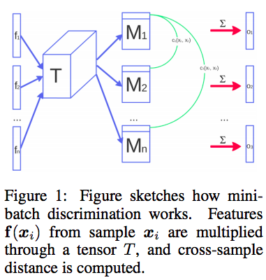

## - [Improved Techniques for Training GANs] (https://arxiv.org/abs/1606.03498)

TLDR; Many techniques to help when training GANs. The main issue is the objective of convergence. Traditionally we use gradient descent but this doesn't always converge to the optimal point because we have a mini-max game where the objective for G and D are not the same. This paper has some improved techniques that benefit from taking into account things like intermediate activation outputs from D and using entire batches' features when determining probability that an X is from training set in D.

### Detailed Notes:

- When training GANs our objective is to find the Nash equilibrium for two player mini-max game. The Nash equilibrium can be intuitively defined as both players wanting to continue their strategies regardless of what the other player is going. For GANs, the Nash equilibrium is when the cost for D is at a minimum with respect to \theta_D and the cost for G is at a minimum with respect to theta_G.

- Traditionally we will use gradient descent  but we should note that J_D = f(\theta_D, \theta_G) and J_G = f(\theta_D, \theta_G). Using gradient descent to lower J_D can increase J_G and vice verse. This doesn't help convergence.

#### Feature Matching

- The first improvement technique is feature matching. The objective of G is to minimize log(1-D(G(z)) which is same maximizing the output of D (log(D(G(z))). Instead of maximizing directly on the output of D, we should maximize on the activation outputs from an intermediate layer in D. Think of a CNN, the intermediate conv layers are the feature detectors whereas the final FC layers are just used for classification. So, likewise, if we train on D's intermediate layer outputs, we are essentially training G to really learn from the discriminative features instead of just the output. 

- So training will now involve minimizing the difference between D's intermediate layer and one of G's intermediate layers. This technique works very well empirically. The new objective looks like this:

#### Minibatch Discrimination

- Issue: I'm going to be very verbose about it to clearly define the issue we are trying to solve because it can be a bit complicated. Let's think about learning a normal distribution. You have certain values of X that will produce high probability (pdf) in the normal distribution. First we pretrain D to match our p_data and now for the same values of X, D produces a high probability. Now it's time to train the GAN. We feed in random noise z into G which transforms into X'. If there X' are far away from the X that result in high P from D, then these X' will generate low P. If they are very similar to the X that result in high P from D, then these X' will generate a high P. G wants (D(G(z)) to be high and this happens when X' are similar to high P causing X. So as G is training, it will map more and more of it's random noise z to X' that very similar to high P resulting X. This is problematic because we are essentially causing G to produce X that converge to 1 max P producing point, which is certainly not learning the whole p_data distribution. This problem is called the collapse of the generator. 

- So why does this happen? It's because we are training D one point at a time. It receives X or X' and sees just that one point and has to determine probability P that the point is from the training set. When is sees the point is wants to see, it generate a high P. This is the crux of the issue leading to collapse of the gradient. Note: we still get the probability for each sample in the batch one at a time, but calculating that one probability now involves all the samples in the batch.

- Solution is to factor in the entire batch. We will take our input, multiply by a tensor (trainable), get the absolute difference in L1 distance between this sample and all other samples in the batch for each row, apply a negative exponential operation and then take the resulting values for each row, sum them up and now we have our minibatch discrimination values. We will concat these to our normal outputs from the intermediate layer. Note: Dimension of the output now will change.

- Why does this work? Since we are using all the other samples in the batch to influence D's prediction, we are effectively avoiding the collapse of the generator with this new side information. 

There are a few more techniques which were proven to be empirically successful in the paper but these two techniques are by far the ones I found to be most impactful.

### Training Points:

- These improved techniques were used with semi-supervised classifications and the results were SOA.

- Results: minibatch discrimination works really well and quickly to produce visually appealing results but empirically, feature matching results in better models (esp. for semi-supervised classification tasks).

### Unique Points:

- Though this paper suggest many nice improvements for training GANs it also does a nice job of really highlighting the fragility of training GANs. There a lot of room for work but I think a lot of improvements are yet to be found and we can get more help from incorporation with reinforcement learning (SeqGAN, infoGAN, etc.)

