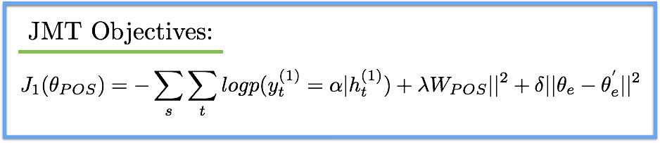

## - [A Joint Many-Task Model: Growing a Neural Network for Multiple NLP Tasks] (https://arxiv.org/abs/1611.01587)

TLDR; The joint many-task model tackles multiple NLP tasks with a single architecture. Tasks are layered such that subsequent and previous tasks benefit from training of the closely-related tasks. Though applied to specific NLP objectives, the proposed model introduces a powerful concept for future research.

### Big Deal:

- The reason this is one of my favorite papers of 2016 is because it introduces a powerful concept for future models to be based on. The idea of using a joint model (JMT) for multiple tasks offers benefits to all the involved tasks because we are able to learn different and useful representations of the same underlying input data. This, in turn, helps all lower level and higher level tasks in the network. The paper not only introduces the concept for five NLP tasks but also address issues of catastrophic forgetting/interference with creating such a joint model.

#### Introduction:

- Training multiple (layered) NLP tasks with a single model allows for increased performance compared to training with separate models or at tasks at the same depth. The layered architecture and joint training offers benefits to lower and higher levels tasks. Furthermore, adaptive training and successive regularization strategies are used to avoid issues such as catastrophic interference (which is when the joint network completely forgets any previously learned information when presented with new information). This allows us to effectively decrease the loss on all the different tasks. 

#### Model:

- For the specific JMT used in the paper for the NLP tasks, both word and n-gram character embeddings were used. Both were learned via the skip-gram objective with negative sampling (for words) and the final representation of each word, x_t, is the concatenation of the word and character vectors for the word. The n-gram char embeddings were shown to provide morphological information for UNK tokens.

- The first task is POS, which also happens to be the only task not to result in SOTA performance at the end. A Bi-LSTM is used to process the input sentence and the resulting hidden states are used with softmax to determine the POS tags. So far, the only inputs to the network were the embedded inputs.

- For the second task, chunking, the inputs are the hidden states from the POS Bi-LSTM, the previous hidden state for the chunking Bi-LSTM, the embedded token and the weighted label embedding y_t^{(pos)}. Each of the POS tags has a learnable embedding which is used in this subsequent chunking layer. The embedding itself is represented by:

- The third task, dependency parsing, is very similar to the previous two tasks. The inputs now include the previous hidden state from the chunking layer, previous hidden state from the dependency parsing layer, the embedded token and now, the addition of both the weight label embeddings of the POS layer and the chunking layer. 

- These POS and chunking representations are used repeatedly because they are able to capture the low level features really well and the JMT is able to build on these representations for the subsequent tasks.

- The fourth and fifth tasks, semantic relatedness and textual entailment, also use Bi-LSTMS and use the POS and chunking representations and label embeddings to predict their respective results. 

#### Training:

- This is the part of the paper that I find more interesting because we need to define our objectives such that we avoid issues such as catastrophic interference. Each of the loss functions factor in the standard probability for the correct label, along with a L2-norm regularization term and our successive regularization term. The token embeddings are specifically identified with a e subscript and other parameters are noted with the task as the subscript. For ex: \theta_POS = (W_POS, b_POS, \theta_e). The successive regularization term utilizes the weights from the current epoch as well as the previous. Below is the objective for the POS tags; the other tasks follow a similar objective structure.

#### Results:

- The results show the increase in performance from using the joint end-to-end structure along with a few more architectural nuances (notably successive regularization, shortcut connections, n-gram char embeddings and vertical connections. 

### Unique Points:

- I was interested to know how layering the tasks would benefit all the different tasks. From the results, it seems that this layered architecture was more important than any model parameters, as it create opportunity for shortcut and vertical connections. All of which allowed for information flow (along both directions) throughout the network for the different tasks. All of the tasks were helping all of the other tasks by altering the representation in such a manner that benefited everyone's objective and avoided forgetting/interference.

- But, even with all of the preventive measures, are there some types of tasks that can be detrimental and lead to interference. All of the tasks in this paper were quite closely related, so at what disparity does the joint model fall apart?

- Also the POS and chunking tasks' representations were used throughout the model. This is because these tasks were able to learn the low level features that will be beneficial for any of the higher level tasks. This leads me to think about the ordering of the tasks. Is there an optimal structure? If there are two tasks that are quite different, will it be beneficial to process them in parallel and keep the respective representations separated?

