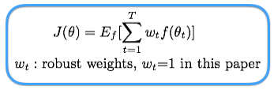

## - [Learning to Learn by Gradient Descent by Gradient Descent] (https://arxiv.org/abs/1606.04474)

TLDR; Use gradient descent to train an LSTM optimizee which is used to determine the parameters of our main optimizer.

### Detailed Notes:
- What does it mean to learn to learn? If you think about all the recent advancements in AI architecture, it all boils down to one thing. We are coming up with better ways to represent our data so that we can better perform some end goal. Ex. Processing images with deep convolutional components or processing text with recurrent architectures. This is an oversimplification but essentially we are using these deep structures to channel and morph our input data into a more informative/descriptive/efficient representation. 

- This paper applies this idea to the traditional gradient descent. Why should we hand pick the parameters of our optimizer, instead, we should learn how to pick those parameters. The idea is using a separate network that functions using the main function it self (f) and the parameters of the optimizer (/theta).

- The update operation to the optimizee's weights looks like the following:

- Our original loss function above depends only on the final optimizee parameter value. In order to train the optimizer it will be more effective to have an objective function that depends on the ENTIRE trajectory of the optimization, for ?some horizon T?.

- The diagram below depicts the flow of gradients. The dashed lines indicate that the gradient DOES NOT flow there. This allows us to state that the gradients of f w.r.t to theta at t are independent of the optimizee's parameters. 

### Training Points:

- Comparisons between learned and hand-crafted optimizers for some quadratics based data and the MNIST dataset. 

- One issue with the method in this paper was that gradients w.r.t optimzee parameters can vary greatly in terms of magnitude at different points of the input. Our optimizer's will tend to focus on these large deviances which will bias the training. So the solution was to preprocess the gradients by applying a log transformation to it. But keep in mind that log(gradient) approaches -infinity as the gradient approaches 0. So the preprocessing step looks like below (p=10 in this paper):

### Unique Points:

- The idea of learning all the components within the deep architecture seems to be very promising. We are making fewer assumptions and simply just modeling based on the data. 

- I particularly enjoyed the many jokes this paper gave rise to, which all went along the tone of "Learning to learn to learn to learn by gradient descent by gradient descent by gradient descent." Which brings up a good point. In the datasets explored in this paper (mainly MNIST), the extra parameters and computation seen to be a favorable addition but what about for more complex/larger architectures and for different types of tasks?

### Official DeepMind Tensorflow Implementation

[GitHub Repo](https://github.com/deepmind/learning-to-learn)

