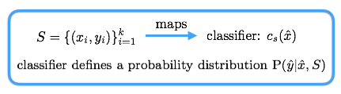
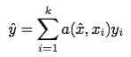
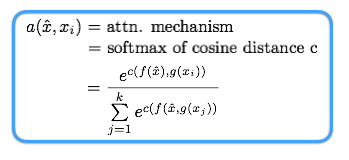
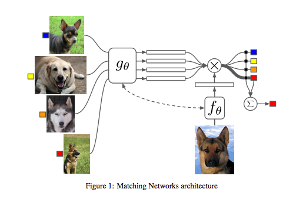
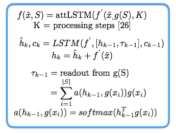

## - [Matching Networks for One Shot Learning](https://arxiv.org/abs/1606.04080)

TLDR; Learning to classify from just a few examples. We use a small labeled support set S and an unlabeled example x to determine the class of the unknown example. We use the support set to learn how to learn the weights for accurately determining the class of the unknown class. 

### Detailed Notes:

- In order to learn from very little supervision and be able to learn a class from a single labelled example, we need to rely on non-parametric methods (using a memory component instead of solely relying on trained weights). 

- These non-parametric models are not affected by some of the common issues with deep parametric models such as catastrophic forgetting. While models such as KNN don't require any training but require us to choose some metric for comparison and determining the closest neighbors. We can't choose some preset feature for accurate performance so we will define some parametric networks to help us come up with a feature representation. 

- This paper uses the Matching Nets (MN) in order to do one-shot learning. These MNs are able to produce test labels for unobserved classes without ANY changes to the network. 

- The small set S is our training set which has known values of x and y. We use this to map to a classifier which uses this small data to determine the probability of test \hat{x}.

#### Attention Kernel

- The attention kernel is used to get a scalar value (attn weight) for each unique label in S. We sum the weights to determine the correct label for \hat{x}.

- Our attention is the softmax (normalization) applied to the cosine distance between the test sample and each of the train samples. f and g are parametric operations that we will take a closer look at next.

#### Full Context Embeddings (f and g)

The parametric networks for f and g are defined below:

- The fully conditional embedding g is a bidirectional LSTM which processed the parametric output of g' (VGG/Inception/etc.)

- The fully conditional embedding f performs K steps of "reads" (attnLSTM) to the parametric output of f' (VGG/Inception/etc.) and g(S).

- Both f and g are about coming up with representations of our one test sample (using f) and all of our train samples in small set S (using g). Once we have the representations, we use cosine distance to compute the similarity and apply softmax to normalize to get our attention scores for each the labels in set S. We then apply the summation to get the best prediction for the label of our single test input \hat{x}.

### Training Points:

- To have a model that is good at one shot learning, train it with one shot learning as well.

- Input data needs to be split in a certain way, so when giving S for a particular inference sample, we should not have the real class of the test sample in our training data. We want our model to infer the best representation possible for our test sample and make the prediction accordingly. 

- Our train data is, however, similar enough (different types of dogs) so we can learn good enough representations to classify the test sample that we have never seen.

- More details in section 2.2

-  MN improves one-shot accuracy on ImageNet from 87.6 percent to
93.2 percent and from 88.0 percent to 93.8 percent on Omniglot compared to other SOTA approaches.

