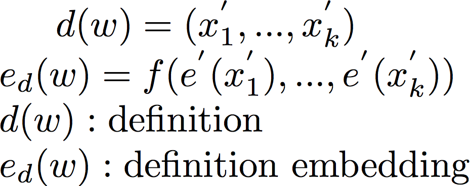

### More on Embeddings (Spring 2017)

This week has been an active week for two particularly interesting papers on embeddings. They were just days apart from each other but address two fundamental issues with traditional word embeddings (Mikolov 2013). 

issues: 
	1.) Failure of euclidean embeddings from mapping latent hierarchies.
	2.) Word embeddings for rare words. 

[Poincare Embeddings for Learning Hierarchical Representations](https://arxiv.org/abs/1705.08039)

Problem:
	Euclidean embeddings are not enough for mapping to latent hierarchical structure.
Solution:
	Embed in hyperbolic space (ex. n-dim Poincare ball - http://mathworld.wolfram.com/PoincareHyperbolicDisk.html). Poincare embeddings perform better than euclidean embeddings on data with latent hierarchies in representation capacity and generalizability. 

What?s wrong with euclidean embeddings?
	Euclidean embeddings like word2vec works by measuring the similarity of objects by distance or inner product in the embedding space. The similarity is supposed to reflect semantic similarity in the case of text. All of this is motivated by the distributional hypothesis - the notion that meaning of words can be deduced from its context. The issue with euclidean embeddings is that they are restricted by the dimensionality of the embedding space while keeping runtime and memory low and prevent overfitting. So how can poincare embeddings made in the hyperbolic space help?

How can embeddings from the hyperbolic space help?
	Hyperbolic geometry is non-euclidean geometry (spaces with constant negative curvature), we can actually think of these spaces as continuous versions of trees. The paper specifically uses the Poincare ball model because it?s easy to do gradient optimization on. So what type of data will benefit the most from embeddings on the hyperbolic space? Data organized with a latent hierarchy (many large datasets) will benefit from this. For example, language data ,which usually has a power law distribution (Zipf), has an innate latent hierarchy. 

Poincare offers two major advantages:
	1.) ?By inducing an appropriate bias on the structure of the embedding space, we aim at learning more parsimonious embeddings for superior generalization performance and decreased runtime and memory complexity?. 
	2.) ?By capturing the hierarchy explicitly in the embedding space, we aim at gaining additional insights about the relationships between symbols and the importance of individual symbols.?

Evaluation:
	I won?t go over the math because it?s actually nicely summarized in Section 3 and the empirical support for Poincare embeddings with public datasets is in Section 4. 

[Learning to Compute Word Embeddings On the Fly](https://arxiv.org/abs/1706.00286)

Problem:
	Embeddings for rare words are tough to learn. We either use pre-trained embeddings or UNK tokens. 
Solution:
	Predict embeddings for rate words on the fly with small auxiliary data with the network trained on the main end-task. 

Why pre-trained embeddings don?t suffice?
	The word can still be rare and the domains for the pre-training may be drastically different from our end task. 

What about character level representations?
	Yes, char level embeddings are quite good for OOVs/ misspellings / semantically similar vernacular, etc. but the paper offers several counter points. The base unit of language if still the word so we want to solve the issue of representing these rare words (in the long tail of the frequency distribution) instead of circumventing the issue with chars (spellings). Char representations are good at capturing morphological derivation (running from run) but it also accidentally capture incorrect relationships between syntactically similar but semantically dissimilar words (run vs rung). Also how something is spelled is useless for named entities (The Beatles).

Method:
	Bahdanau et. al. propose using auxiliary data to get embeddings for rare words. Auxiliary data can consist of dictionary definitions, wikipedia articles, spellings, etc. The auxiliary information (can be one source or multiple) is used to determine the ?on the fly? embeddings. 

	We can either create the embeddings using mean pooling or the last state of an LSTM as f. Once we have the embeddings, we have several options for how we want to use them. We can 1.) We can combine them with the pretrained embeddings (sum) or conditionally add them together e = e(pretrained) + W(e(on the fly)) where W is a trainable set of weights. We could also just use them where we would traditionally use the UNK token. 
	

Where does this really benefit me?
	Any case where there is an extended long tail such as in technical writing where we have many rare terms but auxiliary information is available.

Evaluation:
	Since there are no preexisting NN-based baselines of testing the method, performance on different tasks was used to determine its usefulness. There was quite a performance boost for question answering, entailment prediction and language modeling. The Q/A task was quite interesting but I would have liked the performance on a task where the answer is not from a continuos sub-span like MS-MARCO. More details are in section 4.

So what do we think about "On the fly" Poincare embeddings?

