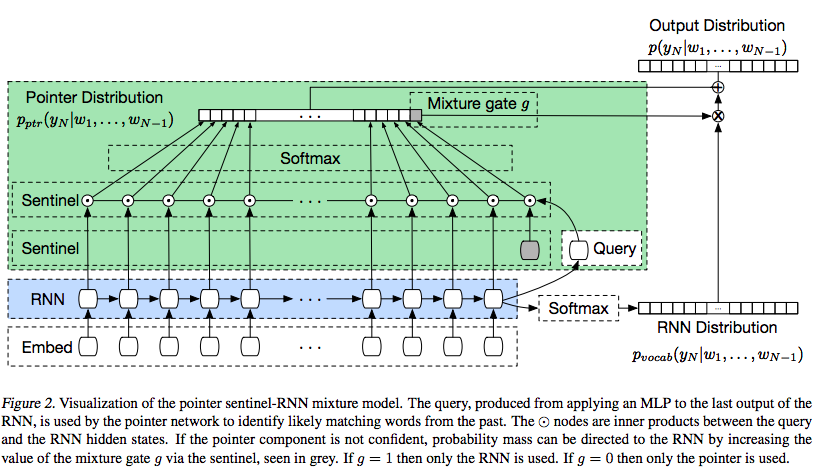
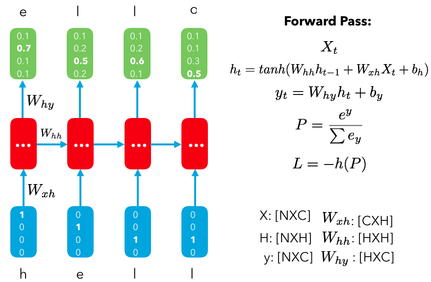
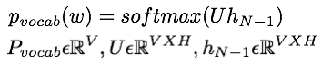
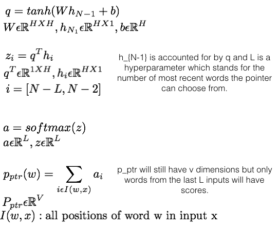
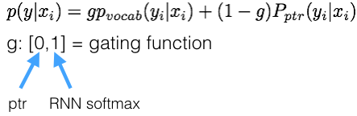
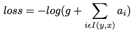

## [Pointer Sentinel Mixture Models](https://arxiv.org/abs/1609.07843)

TLDR; Using pointer networks to predict the next item in a sequence based on context. Traditional softmax classifiers cannot usually give rare words or names as appropriate outputs when they are in fact the correct outputs. Pointers can help solve this issue by puling the output from the inputs. 

There's actually a very good need for a mixture model like this, using both softmax and the pointer network. With something like negative sampling, we only use a subset of all possible classes in the softmax because using all the classes is not feasible. Here, we would be tuning the model to predict the most likely subsequent word given the context. It is unlikely we would learn to appropriately predict a rare word at the right time. With this pointer network, we can do this. 

I think this is a very cool architectural improvement and can really help out with Q/A style NLP, where the responses are often words that are not used so often but can be integral parts of the questions being asked. 

### Detailed Notes:
- Pointers work by pulling outputs from the input itself and so are capable of producing rare words, names, etc. but their outputs are confined to the inputs. 

- The diagram above is a mixture model where the pointer decides when to use the traditional softmax classifier. The probability of each subsequent word in a joint probability from our pointer and RNN softmax. 

- The traditional RNN softmax classifier determines the probability of the next word using the current state h_t, which is a function of the previous state: h_t = f(h_{t-1}). 

- Therefore, for the RNN softmax:

- A major disadvantage with softmax and several derivative approaches (NCE, negative sampling, etc.) is that it is uncommon to predict rare words, when in fact, they might be the most appropriate word. Pointer networks helps us do this. 

- The pointer network takes into account all the previous words (context) in order to generate the output (next word). 

- Here we have a separate query variable Q that applied an MLP on the previous hidden state in order to prevent giving too much attention on the previous word (input).

- An example where pointer network is very useful is when the next correct word is very rare, like a name. One obvious drawback of the pointer network is that our outputs can only come from previous words in the input. 

- The solution to this dilemma is to determine the p(w) for the next word by using both the pointer and RNN softmax distributions. A gating function will decide how much each distribution to use. 

- The objective to optimize will involve both the gating mechanism and the chance that the correct vocab rests in the input itself (ptr distribution). I(y,x) is all positions of the correct output y in input x. 

### Training Points:

- Specific details for multiple models with ranging configurations in paper.

### Unique Points:

- WikiText, made for this paper, is the new replacement for Penn treebank (PTB). Main reasons for new dataset was limitation of only 10k words in PTB, lack of punctuation and all lower case letters. 

