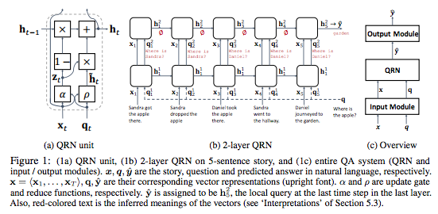
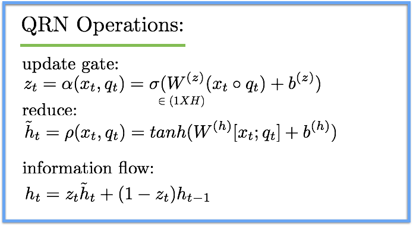
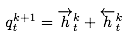
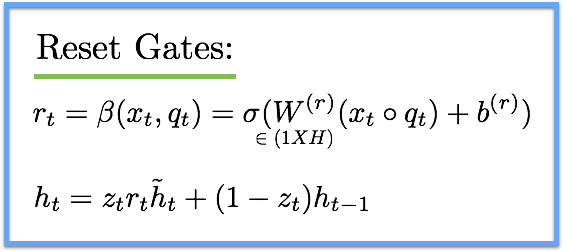
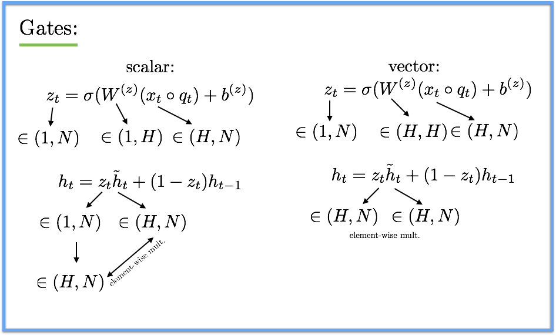
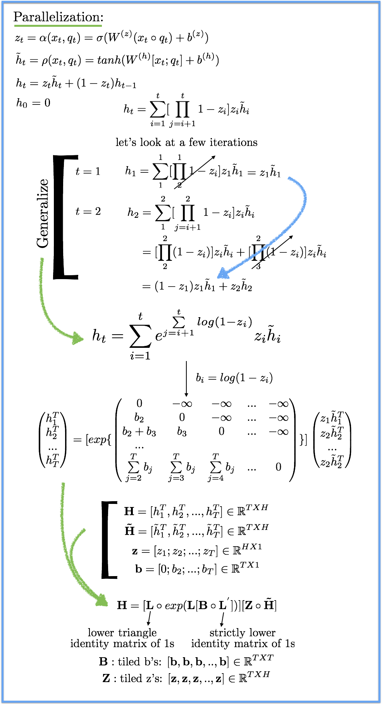
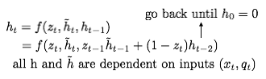

## - [Query-Reduction Networks for Question Answering] (https://arxiv.org/abs/1606.04582)

TLDR; The Query-Reduction Network (QRN) is capable of reducing a textual query into a more informed query by processing the context information. The network also has the ability to parallelize over the time dimension, unlike traditional recurrent structures. 

[Skip the jibber-jabber and take me to the parallelization.](#Parallelization)

### Detailed Notes:

#### Advantages:

- What is query reduction? It is the ability to transform the given query into a more informed query which will result in the answer from the context. For example, if the original question is "Where is the apple" but in the context is the fact that "Sandra got the apple there", the more apt question to ask at this point is "Where is Sandra". We are "reducing" the original query to the pertinent query.

- Basic RNN-based architectures for question answering over multiple facts have shown poor performance. This is due to the instability over long-term processing with contextual information. To address this, recent models used a global attention mechanism but this interface also has a drawback. The attention mechanism can focus on a single sentence from the context per layer and can perform multi-hop reasoning but the order of the context is lost. Additionally, traditional recurrent architectures cannot offer parallelization across the time dimension.

- To address these issues, the QRN offers three main advantages. First, the QRN is able to reduce the query to a more informed query using the context sentences. Second, the QRN is able to incorporate the order of the inputs (much like attnGRU from DMN+ by Socher et. al. with difference discussed later on) when processing the context with attention. This puts the QRN is between an attentional interface and an RNN since attention summarizes all inputs into one context vector and RNN processes each one individually. This combination allows us to give weight to each input sentence as it is going through the recurrent structure. The third advantage is that the QRN can be parallelized over the time dimension because it only requires the inputs to determine the candidate query (\tilde{h_t}), This parallel attribute also allows the QRN to be free of the vanishing gradient issue which arises from long term processing of inputs and previous hidden states. 

#### Model:

- The input to the model will be the context sentences and the question. We will take each word of the context, embed it and then apply the positional encoder (Weston el al., 2015). This will give us x_t which is 1XH (H=d in paper) and represents the embedded sentence. The same procedure is applied to the question. We can now feed in one embedded sentence at a time along with embedded question (which is the same input every time). 

- We will focus on the QRN unit below, but the inputs are the embedded sentences and the question. Each QRN unit generates a hidden state. The output is \hat{y} which is the last hidden state (dim H). An output module converts this to dim len(vocab) using softmax weights and we apply softmax and take the argmax as the predicted answer. The loss is simple the cross entropy between this predicted word and the actual answer. The training specifications are under Section 5.2

#### QRN Unit:

- Now, let's take a closer look at the QRN unit. For the QA task, the QRN accepts two inputs (the embedded context sentences and the embedded question). It also generates two outputs (a hidden state and the original input context sentence without any modification). The internal functions inside the QRN are as follows: First is a sigmoid operation (update gate function) that is meant to measure the relevance between the sentence and the local query. Second is a tanh operation (reduce function) which is meant to convert the local query to a candidate state, which is a reduced (transformed) query. Note: this candidate query is not the complete transformed state we used to convert to an actual transformed query. The actual reduced query is the h_t which uses this candidate hidden state \tilde{h}_t and the previous hidden state h_{t-1}.

- As we can see, the QRN processed one input context sentence at a time and we have our scalar update gate z for each input. This is almost like attention except for the fact that we are using the sigmoid operation. This means that each input has importance between (0,1). With global attention mechanisms, we apply softmax which makes the sum of all the inputs' importances to be 1. This is also the main discrepancy between the QRN and the attention GRU from the DMN+ paper. In the DMN+ model, we first apply global attention to all the inputs and get the softmax scores for each input. Then, we feed in one input at a time and apply the respective attention scores instead of an update gate. 

- We can extend the QRN unit to stacked layers of units which was proven to perform well when reasoning over multiple facts. The local query input to subsequent layers will just be the hidden state from the previous layer such that q_t^{k+1} = h_t^k and of course the context input x_t is the same as for that other layers since it never gets altered.

- For QA tasks, we can also benefit from future sentences especially when trying to reformulate the query. So we can use a bidirectional QRN and we can even allow the cells in both directions to share variables. (so no need to define two explicit forward and backward cells, just use the same for both directions).

#### Extensions:

- The paper also explores a few extensions for the QRN. We can use reset gates in order to nullify the candidate hidden state when required. This is as simple as adding another gate (reset gate) and accounting for it when calculating our output hidden state.

- Another extension is the use of vector gates. This is a commonly experimented extension in several other attention based recurrent papers as well (DMN+). Right now we receive our scalar values z and r (update and reset values) as scalars. Each input receives an update and reset scalar and we multiple the input by that scalar. We will leave out the reset scalar but the same things we are doing with the update value can be applied for it as well. 

#### Parallelization:

- Now for one of the coolest aspects of the QRN. We can parallelize our QRN across the time dimension. There has been quite a bit of work recently on trying to parallelize aspects of recurrent architectures, most notably the quasi recurrent neural network (Q-RNN) by Socher et al. The QRNN architecture involves convolution but the QRN here is a bit simpler. In typical recurrent structures, the candidate state requires the previous hidden state. However, the QRN does not require this dependency and so we can parallelize across time. In fact the candidate vector is only based on the input. Let's take a look at the math. Note: the same math can be applied to the vectorized gates version as well.

- Computation of H is now able to be parallelized and GPU compatible with a reasonable batch size (~ 100) and T and H (num hidden units, aka d in the paper) are around same ball park.

- One more time I want to reiterate the fact that all the hidden state (candidate hidden state and final hidden state for each input context) are all only dependent on the inputs. This is what allows us to parallelize the network. 

#### How to use hidden state to get reduced query:

#### Ablation:

