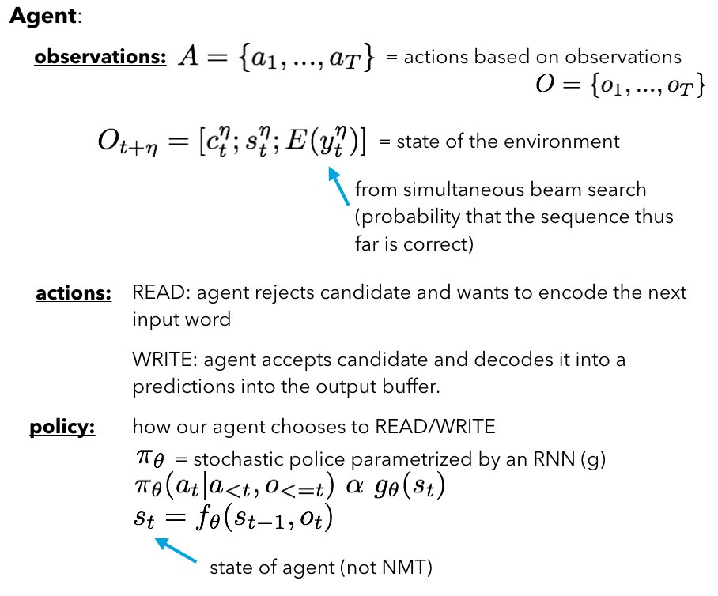

## - [Learning to Translate in Real-time with Neural Machine Translation](https://arxiv.org/abs/1610.00388)

TLDR; An implementation of realtime neural machine translation (NMT) by using an RL agent that decides when to READ input source language and WRITE output target language.

### Detailed Notes:

- This is very similar architecture as Bahdanau's NMT with attention from 2014 but we will be having an RL agent that will decide when to READ from input and WRITE output translation. We cannot wait for entire input to be processed for real-time NMT because we want quick results for situations like conversations. So the agent will decide at what points of the input sequence to READ and when to translate since the last READ.

- The total number of actions is the sum of all the READs and WRITEs.

- The main tradeoff here is deciding between a quality translation and a quick translation as the input is coming in realtime. The encoder and decoder components are very similar to the traditional NMT with attention from Bahdanau's 2014 implementation. 

- The main difference is in the attention decoder. We will only have access to the hidden states of the input up until time t. We refer to this as the subset \eta. 

- As for the RL agent, we will be using a stochastic policy parametrized by an RNN in order to decide when to READ/WRITE. I'll be coding out my own version for this part that will produce similar results (ish).

- The details of the RL component are described in the paper but I won't expand on them here and again in the code. 

- Picking the best translation sequence was done by using simultaneous beam search. This is an extension of the traditional beam search, where at each step, we don't just keep the argmax but may keep the top few predicted tokens. We do this at each step and multiple the probabilities for each token along the way. This is a great way to recover after a fatal initial prediction error. But, this method can also grow quickly (computationally expensive) so we restrict to k trajectories at any particular time.

- With simultaneous k trajectories, we will keep doing WRITEs until a READ is the next action, at which time we will find the best prediction sequence. We will feed this into the agent for making the subsequent decision. We will be feeding it as the expected probability of y_t^\eta (subset of translation thus far at \eta state of encoder).

### Training Points:

- Agent: recurrent policy with 512 GRU with softmax for action distribution. Policy gradient was trained with Adam optimizer and k=5 trajectories for simultaneous beam search. 

### Unique Points:

- Training data generation was not so sound in my opinion. A fully trained NMT (trained on complete inputs and translations) was used to translate of segments. I don't think this is such a good idea (even though the paper said it was good enough). I'd need to know more information about how well those NMT performed because for all we know, we could just be training this model to behave the way that NMT behaves on segmented inputs (could be poor, could be good). 

- Simultaneous beam search was not that helpful because of the need for long periods of WRITEs to get any meaningful sequence probabilities. The paper suggests factoring in the beam search probabilites into the observation as well (on top of the agent), so the update beam search probabilities are always incorporated into the next decision (could be used to extend for more WRITEs). 

- Comparison was done with many previous real time translation attempts such as wait-one-step, segmentation, etc.

