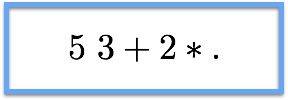

## - [Making Neural Programming Architecture Generalize Via Recursion](https://openreview.net/pdf?id=BkbY4psgg)

```
Making Neural Programming Architecture Generalize Via Recursion
Jonathon Cai, Richard Shin, Dawn Song
https://openreview.net/pdf?id=BkbY4psgg
```

TLDR; Neural networks that try to learn programs have very poor generalizability and interpretability. Recursion to tackle both issues for a variety of sorts and arithmetic operations by breaking down the task into smaller modules and reduce the domain for each NN component.

### Introduction:

- We want to achieve generalizability and interpretability with a small number of training samples. However, models have trouble generalizing when gives more complex inputs compared to training data. The authors refer to the "undesirable and uninterpretable dependencies" learned during training to be main source of error. When our models are training, it is very easy for them to come up with representations from the input that are helpful it accurately producing outputs. However, the representations that are learned could be nonsensical and only work for a particular training set. These learned representations break down when given inputs of varied complexity compared to the training inputs and therefore, offer poor generalization.

- Even techniques to improve this generalization, such as curriculum learning (which is training a model using inputs of increasing complexity), fail to help generalize past a particular level of complexity. Again, these errors can be attributed to the learned representations that do not reflect the true semantics necessary for the task. 

- The abstraction of recursion works by doing two things. First, the given problem is broken down into smaller problems (which is highly applicable for the different programming tasks in the paper). Second, each component of the model will only be responsible for a given domain. Recursion allows the network to learn the "right" program and offer perfect generalization for novel inputs. Additionally, due to the scope of the tasks and the advantage of recursion, our models can learn the right representations without a lot of training data. We no longer have to exhaustively iterate through many combinations of inputs/outputs in order to model of decent generalization. 

- Good generalization is all about being to learn the true task semantics and not some "irrelevant, spurious" representation of the input data that just helps optimize with training. Additionally, good generalizability does not necessarily mean that your model does well with a set test data. It is important that the test data contains varying amounts of complexity compared to the training set. Otherwise, the irrelevant and spurious representations that were learned will workout just fine for this biased test set.

### Recursion: 

- The concept of recursion contains two properties: base cases (which allow for the task to finish) and rules to decompose the inputs to the base cases. 

- Below are the steps for the general neural programming inference. For any task, we start with a scratch pad (external environment) Q. For our addition case, this would be a 4 X N X K tensor whose rows (4) are for two input numbers (to add), carry bits and the output. K is set to 11 to include the 10 possible digits for each column along with an end token. This slice of Q, e_t, is fed along with the program's arguments, a_t, into a domain-specific encoder. This encoder is the first learnable parameters of the NPI. Then, we feed in the state from the encoder along with the program's embedding, p_t into a task-agnostic core in order to get the next hidden state. The program's embedding and the task-agnostic core are two more learnable parameters for the NPI. The rest of the processes allow to calculate the probabilities for the next program and the respective arguments and environment slice for the operation. 


- For our grade school addition task, the domain-specific encoder is in the eq below. Keep in mind that calling the recursive operation allows to disregard any previous operation. This means that we also reset the hidden states of the LSTM when ever the recursive call is made. This proves to be really helpful for generalization because we don't end up learning irrelevant details to the task such as the arbitrary length of the problem. This type of architecture works for the programming tasks in the paper and not necessarily for any general task, especially ones that involve memory, dependencies, etc.


###  Takeaway:

- The paper introduced the concept of recursion in neural programs which resulted in perfect generalization. The models were able to learn the right representations needed to generalize well to increasing complexities of input data. This was achieved with using a very small number of training samples. We specifically focused on the addition task, which showed perfect generalization for any length inputs.

- It's exciting to see an increased focus on generalization and interpretability as our models just deeper. Two of the three top papers for ICLR 2017 have to do with generalization. This paper applied the abstract concept of recursion for proved perfect generalization. It will be interesting to see different types of tasks use recursion or concepts from recursion to achieve better results. 

### Necessary Background:

- In order to understand how to apply recursion to the tasks in this paper (addition and types of sorts), we need to familiarize ourselves with a stack-oriented programming language (Forth, RPL, etc.). The syntax involves running recursive subroutines called "words", which all use a stack for control flow. This allows for efficient memory use and really fast execution speeds. 

- Before we dive into the tasks from the paper, let's do a very simple arithmetic problem and see how a sequence is processed. Let's say I want to execute the following:



- First, we push 5 on the stack and then push 3 on top of that. We then add both values (destructively) with 8 and then multiply by 2 to get 16. Now, we can go ahead and define a "word" to execute this operation repeatedly. 

- The main example we will focus on here is the Grade School Addition, which involves understanding the reverse Polish notation (aka postfix notation). Let's see a simple addition example from the original [neural programmer-interpreters (NPI) paper](https://arxiv.org/abs/1511.06279). 


- The state depicted in the diagram is the carry step before the last summation action. The "words" we have defined for the addition operation is ADD which is composed of ADD1 and LSHIFT. 


- As you can see, the trace of the addition steps can be rewritten in a recursive manner as follows:

