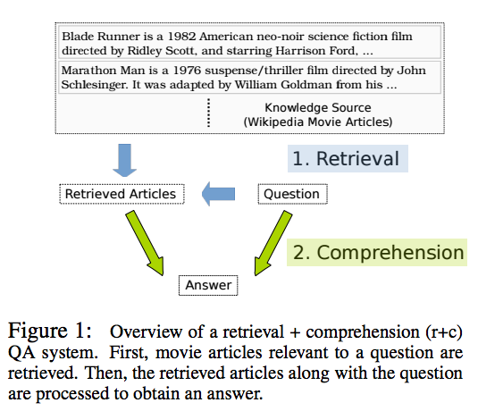
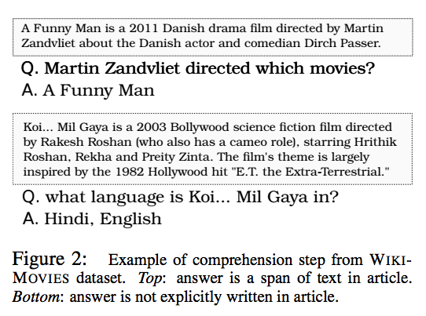
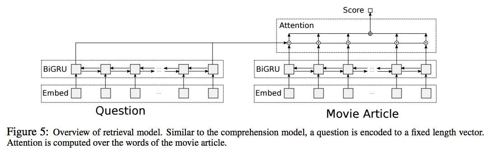
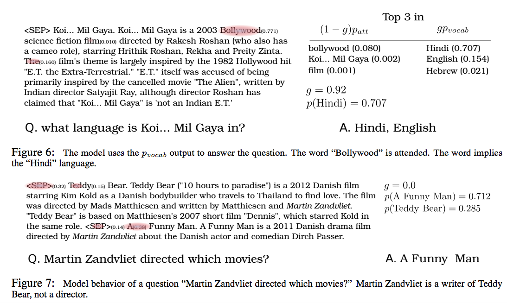

## - [Question Answering from Unstructured Text by Retrieval and Comprehension](https://arxiv.org/abs/1703.08885)

```
Question Answering from Unstructured Text by Retrieval and Comprehension
Yusuke Watanabe, Bhuwan Dhingra, Ruslan Salakhutdinov
[https://arxiv.org/abs/1703.08885](https://arxiv.org/abs/1703.08885)
```

TLDR; Give a set of contexts and a query, retrieve the relevant context(s) and then comprehend it to answer the query.

- This paper is special for many reasons. It is one of the first works to do QA in an unstructured setting. The main component of QA works back in 2013-2015 involved heavy use of knowledge bases (KBs). More recent papers started to answer queries based on text alone but almost all were based on a single context. The work done in this paper offers significant insight towards production QA tool development.

### Task

- Given some context(s) and a query, the goal is to:
	1. Retrieve the relevant contexts
	2. Comprehend relevant contexts to answer query
	

	
- Explicit knowledge bases are not used for several reasons:
	- KBs only support certain types of answer schemas. The items in the KB have to easily relatable (ex. size, shape, parent/child relationship, etc.) This makes it hard to capture abstract concepts.
	- KBs can also be expensive to construct and maintain.
	- Therefore the solution is to simply use unstructured text, as this does not limit to specific answer schemas.

- There are two main methods of answering queries in reading comprehension.
	1. Extract answer as a span from the context.
	2. Select answer from fixed vocabulary.
The tricky part is that different questions may require different model types. Take a look at these two different question, which require two different model types. The model in this paper uses a latent variable mixture model to combine both model types and create an end-to-end structure for comprehension.



### Dataset: WIKIMOVIES

- WIKIMOVIES contains Q/A pairs with movie articles. We will use just the first paragraph from each article as context since it usually provides a good summary. There are also a list of entities, which has answers to all of the questions.

- The dataset is split into two parts:
	1. WIKIMOVIES-FL: All the queries
	2. WIKIMOVIES-WE: only span level Q/A pairs are used
The questions themselves can also be split into 13 categories so we can see how the model fares of different types of concepts.

### Retrieval

- The retrieval process involves processing the set of contexts and determining which are relevant. Several models were tested but the one that fared well was the learning model (R2). This retrieval method yields relevancy scores for contexts using query aware attention. 




- A 4th order polynomial expression is sued in order to emphasize the relevant tokens. Empirically validates and better than exponential and pure softmax approaches.

### Comprehension

- Now that we retrieved the set of relevant contexts, we need to comprehend and answer the query. All of the relevant contexts are combined together and then processed.


- Similar to retrieval processing, the context is embedded and fed into a BI-GRU and is combined via attention with the query representations. Each word in the context now has a query aware attention score.

- We develop probabilities for the entities from the context (P_attn) and, as well as, all the entities in the corpus entity list E. We then combine these two with a mixture coefficient in order to determine the probability of every single entity from list E. 


- Here is an example of why both scores are relevant for different situations. 


- The loss accounts for the probability of the words in the actual answer.


### Unique Points:

- Using the latent mixture model to answer context level and entity level questions allows us to have one end-to-end structure that covers the majority of question types. 

- Using a list of entities, though it makes sense for the movie context, is a little bit of extra work. Since we sought to get rid of KBs, I feel this pre-made list should also be eliminated. However, this is a very difficult ask. When we answer questions, we often draw from past experiences to answer using words that may not appear in the observed context. Perhaps, creating an entity list during inference that are related to the query and context can be something to look into.

- Question types showed interesting obstacle for Q/A. Poor performance when dealing with abstract topics (ex. tags) aka things that are not so easy to put into KBs. They cannot offer clear relationships based on size, color, etc. [Dynamic Coattention Network](https://arxiv.org/abs/1611.01604) captured who/what/when/where types of concepts well. The questions that asked why did not fare so well. With improving comprehension models, we can capture more concepts and relate them. This particular use case was able to answer questions with concepts based on language, players in movie industry (actors, directors, etc.). The concepts that were learned could still be learned via overfitting though because the test set also involved these concepts. I think a more diverse dataset can help further investigate this.

- Emphasizing the attention score to the 4th order during the retrieval phase in order to prioritize relevant terms was interesting. It empirically worked for retrieval but not used in comprehension. I think this will just favor the contexts that have strong query-aware responses, which can be more disparate for retrieval compared to comprehension. 

- Not sure how much upstream retrieval process actually helped with comprehension but it si a necessary component since real world Q/A will not have ground truth contexts to choose from all the time. 

- Recurring theme of query-aware attention was used when processing contexts.

- Mixture model is a cool idea and seems quite similar to Stephen Merity's [Pointer Sentinel Mixture Modelsl](https://arxiv.org/abs/1609.07843) paper (with perspective of combining two probabilities with a mixture coefficient). 


