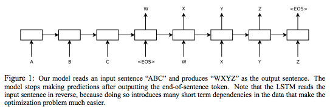
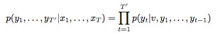

## [Sequence to Sequence Learning with Neural Network](https://arxiv.org/pdf/1409.3215v3.pdf)

TLDR; Sequence-to-sequence models for language translation involves use of two LSTMs. The first encodes the input language and outputs a fixed dimensional output v made form embeddings of the input. The v is fed into another LSTM to output the predicted translated sentence. Evaluation involves using softmax with beam search for each token. 

### Detailed Notes:

- Two LSTMs: one for input sequence and another for output each with 4 layers. The first encodes the input language and outputs a fixed dimensional output v made form embeddings of the input. The v is fed into another LSTM to output the predicted translated sentence.

- Since the inputs are a,b,c to generate d,e,f, if see that the c gets read first. Therefore, we feed our input in reverse order. This way a is the last input and d (which corresponds to a) is the first output. This proximity "establishes communication" between the input and output better. Of course, we only have this proximity up to the halfway point and then it's same feeding it the normal way, but this reduces the time lag by a bit. This greatly boosted performance as well. 

- When predicted each word, we will use [beam search](https://www.youtube.com/watch?v=UXW6Cs82UKo). Even beam of 1 (greedy) is good enough but best results come from beam of size 2. In case your forgot, this means sampling multiple times and then after each sample prune and keep just 2 of the highest product of probabilities (see video for more details).

### Training Points:

- 4 layer LSTMs with 1000 hidden units (cells) at each layer and 1000-d word embeddings with input language vocab of 160,000 (out of 304M) and output french vocab of 80,000 (out of 348M). Other tokens are replaced with "UNK".

- weights initialized to [-0.08, 0.08]

- SGD w/out momentum with fixed lr of 0.7. After 5 epochs, half the lr at every 0.5 epoch. Train for total of 7.5 epochs. 

- Each batch has 128 sequences.

- LSTMs don't suffer from vanishing gradients but still suffer from exploding gradients, so we clip the norm of the gradient to [10, 25]. 

- Make sure sentences in a particular minibatch are of the same length (approx.) to speed up the process and avoid wasteful computation. 

- Training for 7.5 epochs takes 10 days on a 8-GPU machine...

### Unique Points:

- Feeding inputs in reverse order to reduce time lag and increase proximity of first input words to first output words. 

