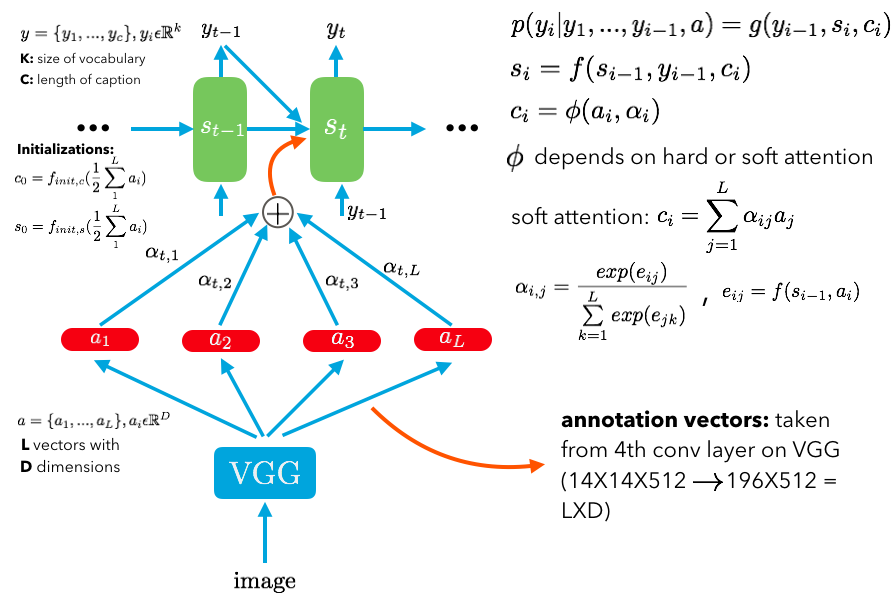

##  [Show, Attend and Tell: Neural Image Caption Generation with Visual Attention](https://arxiv.org/abs/1502.03044)

TLDR; Caption captioning with a CNN and a RNN. Instead of feeding a static input into the RNN (static input is the final layer prior to softmax in the CNN that represents the input image as a vector). We now feed in the image with attention where the RNN can decide, at each time step to generate the word, which parts of the image to focus on.

### Detailed Notes:

- The caption is generated by a RNN with LSTM units which takes is previous word, previous state and a context vector in order to generate the next work in the caption. The way the context vector is created depends on the type of attention mechanism (hard vs. soft). 

- Soft (deterministic) attention vs hard (stochastic) attention. Hard attention is based on stochastic decisions (which are discrete so derivatives are 0). The loss is a variational bound on the marginal log likelihood. 

- Soft attention is a deterministic approach taking into account all the L annotation vectors (2d vectors from the CNN) and weights them depending on current time i and vector j of L total vectors. This method is much less complicated than hard attention and we can use traditional BBPT for training. 

- Annotation vectors are taken from the 4th conv layer (right before max pooling). These annotation vectors (in VGG) are originally 14X14X512, which we flatten to a 196X512 2d vector where L=196 and D = 512. So at each step of generating the next word's context vector, we look at teach of the 196 annotation vectors. These annotation vectors are the same thing as the output of the bidirectional encoder in the machine translation seq-to-seq model. 

- We took the annotation vectors from one of the last conv layers because this si best representation of features in the image, rather than taking from the FC layers.

### Training Points:

- The entire network is trained end-to-end (from caption, all the way back to input image). We can start with pre-trained CNN, where we can freeze everything but last few layers depending on our dataset. We can also train from complete scratch CNN. 

- We use small 3X3 kernels (filters) in the CNN because of the high nonlinearity it offers and the significantly fewer number of hyperparameters. (See my notes of cs231 (convnets in practice section) for a more rigorous proof of this.)

- Only regularization was dropout and early stopping of BLEU scores. 

### Unique Points:

- In most of the experimental datasets in this paper, hard attention performed slightly better than soft attention. 
