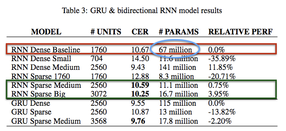

## [Exploring Sparsity in Recurrent Neural Networks](https://arxiv.org/abs/1704.05119)

TLDR; Reduce number of parameters in your large recurrent models while maintaining high performance.

### Synopsis
The issue is that large models are hard to deploy on embedded devices/ mobile phones. Even if your inference speed is acceptable, these large models can still affect your battery life on devices. The proposed solution is to reduce the number of parameters in models by pruning (zeroing) weights during the initial training period. Also with fewer parameters, you can store them in cache for [super-linear](http://blog.sflow.com/2010/09/superlinear.html) increase in performance. 

#### Results:
	1. Network size decreases ~90%
	2. Training time remains constant
	3. 2x-7x speed up in inference time.
	4. Maintain accuracy

#### Drawbacks:
Going from a dense representation of our weights to sparse does have a penalty but it can be overcome once the sparsity factor (%) is large enough. 

#### Method details:
While our network is training, more and more weights are set to zero based on a `monotonically increasing threshold`. Each layer can have its own threshold function but this paper allows each type of layer (recurrent, FC, etc.) to share the threshold function. Similar to dropout, we use Bernoulli masks where each weight has a mask value (0 or 1). At the start of training, all values in the mask are one and once the pruning begins, the masks are updated by zeroing the mask values below the threshold. The threshold is initialized and updated with pruning hyper-parameters.


(*) q is from previously trained model (90th percentile of the sorted abs value of weights)

#### Code:
``` python
params = [model.fc1.weight.data, ..., ]
masks = [torch.ones(param.size()) for param in params]
current_itr = 0

while self.training:
    for i, param in enumerate(params):
        param = (param and masks[i]) # apply mask
        
        if (current_itr > start_itr) and (current_itr < end_itr):
            if (current_itr % freq == 0):
                if (current_itr < ramp_itr):
                    e = theta * (current_itr - start_itr + 1)/freq
                else:
                    e = (theta * (ramp_itr - start_itr + 1) + \
                         phi * (current_itr - ramp_itr + 1))/freq
                 
                # update the mask         
                masks[i] = abs(param) > e
                
    current itr += 1
    ...

    # prune weights
    weights[i] = weight[i] * masks[i].float()
```
(*) When it comes time to prune the rights, we will use space matrix-vector multiplication ([spMV](https://cseweb.ucsd.edu/classes/sp11/cse291-c/talks/mavec04.ppt) - used with [cuSPARSE](http://docs.nvidia.com/cuda/cusparse/#axzz4hZNtMBEL) libraries).

### Results:



### Unique points:
- Gradual pruning works better than hard pruning which is zeroing the parameters at the end of particular epochs. Gradual pruning results in 7%-9% better performance (for Deep Speech 2).
- This paper only tested this with vanilla RNNs, FC (fully-connected), and GRUs with speech data.
- Authors suggest applying pruning to only recurrent and fully-connected layers. Things like biases, batch-norm components, convolution filters, etc. are too small and do not need pruning. 
- Using the sparse models is better than using dense models with fewer parameters.
- Great memory reduction and can do even more with quantizing down (float16, etc.)
- Also, we get super fast performance because with spare operations (spMV) we can get near device memory bandwidth. 
- Tested these with a few language modeling tasks and performance was similar but my models did not have as large quantities of parameters to start with. 
- Paper also alluded to comparing this technique with L1 regularization (which acts as a natural feature/parameter selector) and comparing the two. With L1 regularization, we have this pruning occurring at every step unlike this pruning procedure. 


