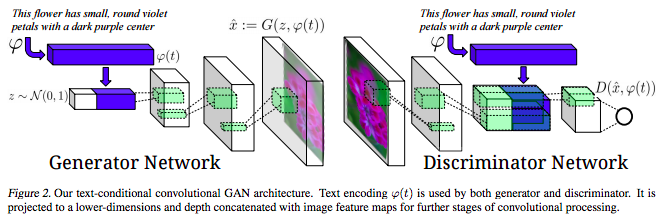
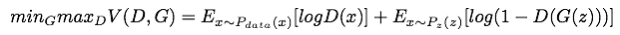
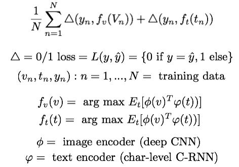
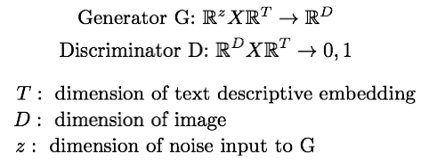
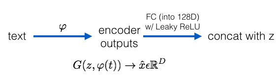
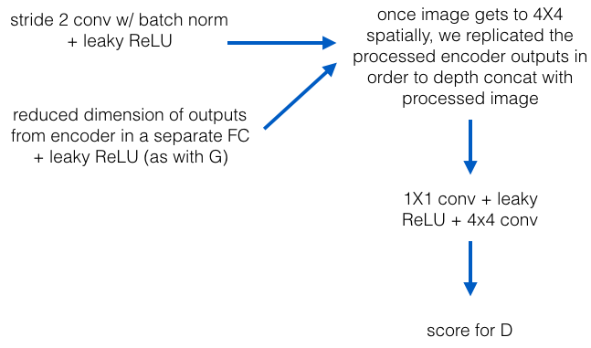
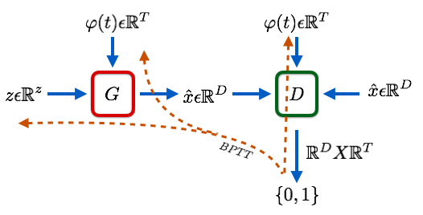
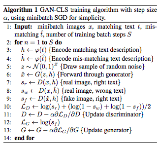
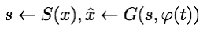
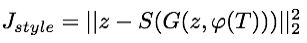

## - [Generative Adversarial Text to Image Synthesis] (https://arxiv.org/abs/1605.05396)

TLDR; Using a DCGAN to generate appropriate images for a given text. G uses a random noise z with text encoder outputs to generate a synthetic image x to feed into D. A training sample x is also fed into D. Both are processed and combined with text encoder outputs and determined if from training sample or not. D will also be fed a synthetic image composed on incorrect text encoder outputs and it will have to classify as NOT from training data. So the generator really has to learn how to make images to fool D that also make sense with the given text. 

### Objective: 
Recall that D will always try to predict the probability that a given sample is from the training data. The first term is for the discriminator and we want to maximize it since we want D to predict that x is from training (since it is) with high probability. The second term is for the generator and we want to minimize it since it is 1 - D(G(z)) bc we want the D(G(z)) to be high since we expect G to trick D, so we want to minimize 1-D(G(z)). 

### Loss:
Our loss is based on 0/1 loss which gives 0 if our prediction is correct and 1 if not correct. We compute the loss for both the images and the text descriptions. 

### DCGAN:
Both G and D are conditioned on text features.

### Generator:
G is used to take the noise input z and the text encoder outputs in order to create the synthetic image x. So ALL G does is create a synthetic image with a text. It will go through D where is it concatenated with the same text but the synthetic image first goes through several convolution operations.

### Discriminator:
D is used take in an image, perform some convolution and then depth concat with the text encoder outputs, perform further convolution and determine if sample is from training or not. 

### Tasks:
Recall that our generator creates a synthetic image and feeds into D. Also recall that our training data simply takes an image and feeds into D. The CORRECT text description for this image is used inside D as well as when constructing synthetic image in G. However, the discriminator is just processing the images it gets, it doesn't know if the text we supply is appropriate or not. Note that we pretrain D on the training data, so in the beginning it can easily separate the training data from synthetic images. But later on it will become more and more difficult. If it only uses the images, it will be difficult to distinguish synthetic from training, so it also needs to factor in for the sentence. So, the discriminator will have three tasks:

	1. Identify REAL images w/ APPROPRIATE text as TRUE
	2. Identify FAKE images w/ APPROPRIATE text as FALSE
	3. Identify FAKE images w/ INCORRECT text as FALSE
	
This gives another signal to G, telling it that it has to not only learn to create synthetic images but learn to create synthetic images that are appropriate for the given text.

Here is a detailed step-by-step of the main algorithm.

### Style transfer:
The textual description will have information such as color, shape, etc. of the bird/flower but may not have any information about the pose or background color in the image. These are features that have to do with the image's style and will not be included in a textual description. So a style transfer method is proposed to solve this.

We will have a style encoder network S, which will take in an image (x) and produce the style s. We can take the style from any query image and use it when producing our synthetic image.

The way that we can train our style encoder is as follows.

Our style encoder can convert a synthetic x back into it's z by inverting G, so basically it's a CNN. We train it so S(G(z, t)) produces a z and compare it to z. They should be the same if S is a true style encoder. As it is training, we use S with a real image x in order to get it's "style representation" s, which is what becomes our refined random noise to use with G to produce our synthetic images. 

