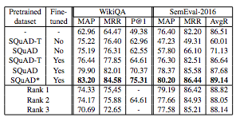
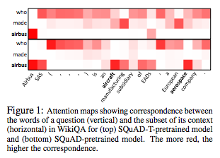
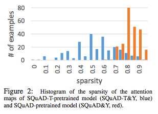

## - [Question Answering through Transfer Learning from Large Fine-grained Supervision Data](https://arxiv.org/abs/1702.02171)

TLDR; NLU tasks (QA, RTE, etc.) can benefit from transfer learning but the degree depends on the source task.

### Introduction:

- Question answering can benefit from transfer learning but the degree depends on the source task. Specifically, a span level QA task was used as the source task for a sentence level QA task. Spoiler: span level source proved to be better for transfer learning than sentence level source task.

- QA tasks have two popular modes of supervision: sentence and span level. Sentence level supervision involves determining the most relevant sentences from a context. Span level supervision involves locating the span of information in the context that contains the answer verbatim.

- The task of this paper is to apply transfer learning from both sentence and span level supervision as the source task and test on a sentence level target task. The source dataset used is the SQuAD dataset from Stanford, which is a span level task in its unaltered form. The target datasets are the WikiQA and the SemEval2016 which are sentence level tasks. A third dataset was also tested as the target set, the SICK dataset, where the main objective is recognizing textual entailment (RTE).

### Understand the Data:

- One of the source datasets is SQuAD. This is a span level task where a question is asked, given a context, and the answer is a continuous span from the context. A modification was made to this dataset, the SQuAD-T, which is now altered to be a sentence level task. The context is split into sentences and each sentence is assessed for relevancy (binary) for answering the query. If the answer span exists in the sentence, then it is relevant. This modification exists in order to properly test the effect of task on transfer learning. Since, both span and sentence level tasks' weights will come from the same original dataset, we can compare the two approaches. 

- Tangential Thought: Though this may seem like a reasonable thing to do, I think some more thought needs to be applied here... The part that troubles me is labeling each sentence with a binary relevancy because the answer span exists. This is what the attention scores for tasks like BaBI reflect but having relevancy just from presence feels strange. For example, even for BaBI, we can have supporting facts and those facts were not supporting just because they contained the answer. 

- The target datasets, WikiQA and SemEval 2016, are both sentence level tasks. Both have to do with determining the relevancy (binary) of each context sentence to answering the query. The third dataset is SICK (I love that name), which involves an RTE task and the specific goal is to determine if a piece of information entails, contradicts or is neutral to a given hypothesis.  

### Model:

- The model used to learn from the source task and then apply on the target dataset is the Bidirectional Attention Flow (BiDAF) (also from AIAI) which is a model that performed quite well on the SQuAD dataset. The particulars of the model are not important here (but details are in my other post on the BiDAF), but the essentials are that the inputs are question q and context x and the output comes from an answer module that gives us the location index of the start and end token of the answer span. 

- A modification of the model is made so that we can use the same model for sentence level tasks. Now the model processes question q and a list of sentences from the context (instead of all at once). Now the output is just a "C-way" classification for each k-th sentence. For our target dataset, this is just a  2-way since the predictions for each sentence are binary. The results are quite straightforward via a max-pooling method:

### Transfer Learning:

- The actual transfer learning involves taking the weights from our BiDAF model pre-trained with the source dataset and then we have the option to further fine-tune the model using the target dataset. When we are transferring from BiDAF to BiDAF-T, span to sentence level, we transfer the weights of only the overlapping layers and then use our modified answer module. Details on the training configurations are provided in Appendix A. 

### Results:

- Here's where things get interesting. When the Bi-DAF-T model is trained on the target datasets, the results are quite poor (1st row). Then, once we introduce transfer learning, the Bi-DAF-T model performs will with the SQUAD-T source dataset but demonstrates superior performance when the source dataset is SQUAD. In other words, we received better results when the source dataset (SQuAD) was of a different nature from the target dataset (sentence level). 

### Analysis:

- One of the reasons the SQuAD dataset led to better results, compared to the SQuAD-T dataset is due to the intrinsic qualities of the task. The span level task led to span-supervised models that were better able to learn syntactic and lexical features. It was able to achieve this by encoding enough about each context word per sentence and the relationship to surrounding words and question. Whereas, the sentence level tasks encode the entire sentence and try to find the relevancy to the query. 

- The attention ablation in in accordance with our reasoning. You can see specific words that are activated (attended to) for related words in the query. 

- The attention maps for span-supervised model are significantly sparse compared to the sentence-supervised models. Again, affirming the notion that the span-level task is able to better capture the relationship between context words and the query. 

### Unique Points:

- We hear a lot about transfer learning with image-based tasks but there is quite a bit of transfer learning with NLU as well. But it is nice to see focus on using transfer learning for more specific tasks like QA instead of the usual embeddings, NER, syntactic parsing, etc. 

- There are actually three popular types of QA: span, sentence and generation. I would like to test the generation and see how it helps for transfer learning where the target task varies. Also test if span and sentence level helps with a span-level target task. Will span still show superior performance (evidence here suggests so)? 
