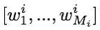

## - [Dynamic Memory Networks for Visual and Textual Question Answering] (https://arxiv.org/abs/1603.01417)

TLDR; A model for textual and visual Q&A. The architecture employs unique attention layers that maintain sequential order unlike soft attention in many seq-to-seq tasks (ex. NMT). The Deep Memory Network+ (DMN+) in this paper out performs the DMN from Kumar et. al. The architecture still involves the use of an episodic memory module but this time, we are able to achieve better performance without explicitly labeling the parts of the input that are helpful for answering a question. 

### Detailed Notes:

- We will break down each of the modules in the DMN+ and mention the key difference between textual and visual Q&A tasks.

#### Input Module:
- The input module processes the input information (story, image, etc.) into N facts F. F is determined by processing the sentences, word by word. It then uses a GRU to process each sentence's embedding f. 

- Now, the problem with using just a single GRU is that the sentences will only have context from the sentences before them but not after them. This isn't a real time task and so we have access to all of the information, therefore, we should be using all of the facts at any given time. Additionally, since we are feeding in word by word for the entire input, the representation for supporting sentences will be too far away since so many words may be in between them.

- The solution is to use a bi-directional GRU and an input fusion layer that allows us to capture supporting sentences. You can think of each sentence as having M_i words so the tokens in each sentence are represented by:

- And the diagram looks like below, with the results of the positional encoder feeding into the input fusion layer (bidirectional GRUs). 

- We could've also just encoded each sentence via a GRU/LSTM, but these were found to overfit compared to the positional encoder. The positional encoder gives us an output f to feed into the input fusion layer (bidirectional GRUs). The value f is determined by the following:

- The input fusion layer takes these input facts f and processed them with the bidreictional GRU. We have now solved our two initial issues. By representing each sentence as a fact f, we avoid the distance issue of embedding word by word. And now the bidirectional GRU allows us to process facts before and after for each fact. This allows us to have contextual information from the input that accounts for past and future events. 

- in this post, I am mostly concerned about the textual Q&A, so I will only briefly touch on the visual processing. The input for the visual question are images and so processing differs slightly. The main idea is that we apply some local feature extraction and then embed those features before feeding into our input fusion layer (same as textual). From this input module, we receive our facts. The initial feature extraction involves rescaling the image to 448X448 and run a conv net on it. We then take the output from the last pooling layer, which has dimension d = 512 X 14 X 14. We treat this as having 196 (14X14) vectors each of size (512). This is like having 512 sentences with 196 words each. Then the feature embedding involves the use a simple MLP with tanh nonlinearity on the concatenation of image vectors and question q. These embeddings are fed into the input fusion layer to get F (collection of processed fs). The bidirectional GRU allows for information sharing from all different parts in the image.

### Training Points:

- DMN+ outperformed DMN on the babI-10k dataset on almost all of the questions.

### Unique Points:

- 

