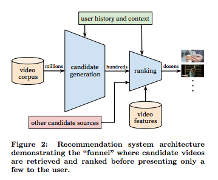
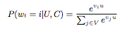
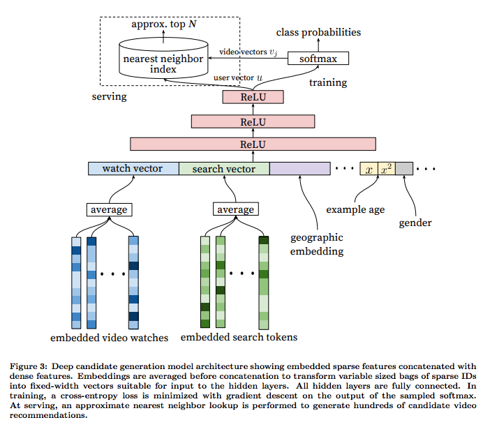
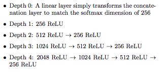

## [Deep Neural Networks for YouTube Recommendations ](https://research.google.com/pubs/pub45530.html)

TLDR; The recommendation is split into two parts: candidate generation and ranking. Candidate generation uses embeddings for video, user and search features to narrow down from millions of videos to hundreds. We use a deep architecture to predict softmax scores for each video to narrow to the hundreds. Then we use another network to mimic ranking the hundreds of videos to dozens. Now we can use ever more features, such as specific video content features for better recommendation. The goal is to predict the time spent on the clicked video, so weighted logistic regression is used for this prediction. 

### Detailed Notes:

- Classic two-stage information retrieval dichotomy: deep candidate generation model and then a separate deep ranking model.

- Videos corpus --> candidate videos generation --> rank the videos --> display recommendations

#### Candidate Generation:
- Input is user's activity history and output is a small subset (100s) of videos from a large corpus. 
The candidate generation step provides broad personalization via collaborative filtering. Some of the features to compare with others users are videos watched, search queries, and demographics. 

- We need to predict that a specific video will be watches at time t among millions of videos i (classes) from a corpus V based on user U and context C. This is a simple softmax where we compare the score for video i with the sum of scores for all the other videos. The inputs for video i and user are embeddings. We also use negative sampling because computation of the softmax denominator is not feasible at this scale. 

- We get the embeddings for videos by technique like CBOW. in CBOW, we use context to predict the target word so similarly here, we use a user's watch history to predict the target video. Once we have the trained embeddings, we can represent the user's watch history as the average of the embeddings for each of the videos in the history. We can also do the same to embed the user's search history. We split the searches into unigrams and bigrams and get the embeddings for each of those. Again, we get these embeddings by training on the searches separately in CBOW fashion (ex. use context search terms to predict target search term for all search queries to get trained token embeddings). Using these embeddings, we embed each uni/bigram and then again average them to get the user's search history as a dense embedded input. User's demographic and device are also embedded and we can also input binary features like gender, age. etc. but normalizing them. 

- All the videos and search tokens were embedded with 256 floats each in a maximum bag size of 50 recent watches and 50 recent searched. This is trained until convergence over all youtube users. 

#### Ranking:

- When ranking, we can input even more features since now we only have to rank 100s of videos. We assign a score to each video using softmax classifier again and rank the scores. We compute cost by seeing which video was actually watched. 

### Training Points:

- When inputting continuous variables, we need to normalize them and also input several powers of the input (x^2, sqrt(x)), "giving the network more expressive power by allowing it to easily form super- and sub-linear functions of the feature."

- Increasing width and depth of hidden layers helps but the trade=off is the CPU time needed. 

### Unique Points:

- Offline measures such as precision, recall, ranking loss, etc. provide very different results compared to live metrics such as A/B testing. 

- In youtube, implicit feedback like thumbs up and likes are sparse and so are not good indications of a positive example. Instead, they use wether a video has been completed as a positive example. Also clicking on the video is not good enough because of issues like "clickbait"

- While training, the age of the video is input as a feature to account for initial popularity. 

- Actual prediction is the time spent on the clicked video, so weighted logistic regression is used for this prediction. 

